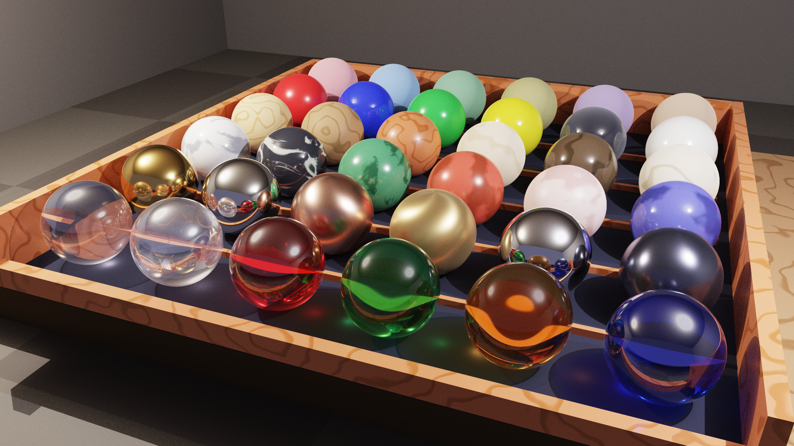
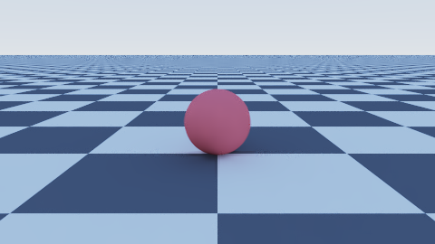

# 3D-Ray — Production-Grade CPU Path Tracer · C# / .NET 10

> 🌐 **English** | [Italiano](README.it.md)

[](https://dotnet.microsoft.com/)
[](https://dotnet.microsoft.com/)

[](https://opensource.org/licenses/MIT)
[](https://github.com/fiorenzobrioni/3d-ray/actions/workflows/dotnet.yml)

A feature-complete CPU path tracer in C#/.NET 10. Disney Principled BSDF, NEE+MIS, NFOR feature-guided denoising, full volumetrics, caustics, multi-stage surface displacement — all driven from a single YAML file, zero code required.



---

## 🔍 Overview

3D-Ray is a full-featured CPU path tracer that takes on production renderer feature sets — driven entirely from a YAML scene description. Describe your scene — lights, materials, geometry, camera — and get a physically accurate, cinematically polished image. No code. No boilerplate. No shader graphs.

The material system is built around a **complete Disney Principled BSDF**: a single type that spans the full gamut, from matte plaster to mirror-polished gold, from deep-water glass with Beer-Lambert thickness absorption to iridescent soap film with thin-film interference — with proper multi-scattering energy compensation for rough metals, subsurface shaping for skin and wax, and Charlie sheen for velvet and microfibre. A layered Mix Material with spatial texture masks handles wear, rust, weathering, and recursive compositions without limits.

The lighting engine is production-class. **Next Event Estimation with Multiple Importance Sampling** converges fast even on complex, occluded lighting setups. **Focused caustics** appear from any specular geometry — glass, water, crystals, mirrors — with no extra scene configuration. **Motion blur** tracks per-camera shutter time from freeze-frame to long cinematic exposures. The full **volumetric pipeline** — homogeneous fog, height fog, Nishita atmosphere, fBm clouds, participating media — integrates seamlessly with NEE inside the volume itself.

Rendering parallelises across all logical CPU cores via a 16×16 tile scheduler, is accelerated by a BVH with parallel SAH construction, and is optionally cleaned by a **feature-guided NFOR denoiser** operating on the linear-HDR beauty before tone mapping. AOV output (albedo, normal, depth, variance) lands as layers in a **multilayer OpenEXR** for downstream compositing. ACES filmic tone mapping closes the pipeline.

A quality ladder from `draft-small` (instant preview, seconds) to `final`/`ultra` (unfiltered, portfolio-ready) lets you iterate fast and ship clean — one flag change, same YAML.

For the detailed roadmap and in-progress features see [**PLANNING**](./PLANNING.md); for the development-cycle history see [**DEVLOG**](./DEVLOG.md).

---

## ✨ Key Features

### Rendering
- 🚀 **Parallel Rendering** — exploits all logical CPU cores for linear performance scaling.
- 🔁 **Path Tracing** with configurable multi-bounce: reflections, refractions, ambient occlusion and colour bleeding emerge naturally from the physical simulation.
- 📷 **Camera with Depth of Field** — configurable aperture and focus distance for photorealistic bokeh effects.
- 🎬 **Multi-Camera** — multiple cameras defined in the same scene, selectable from the CLI by name or index to generate multiple viewpoints from a single YAML file.
- 💨 **Motion Blur** — physically correct motion blur for objects and camera: moving elements trace streaks proportional to their speed during the exposure. Shutter opening is configurable per-camera, from freeze-frame to long cinematic exposures.
- 🎯 **Next Event Estimation with MIS** — at each bounce the engine aims directly at lights instead of waiting for a ray to hit them by chance, automatically balancing the two approaches to converge faster with less noise. Works with all materials and inside volumes (fog, smoke).
- 🔬 **Focused Caustics** — concentrated light spots that glass, water, crystals and mirrors project onto a surface: lens halos, bright reflections, coloured shadows under tinted glass. Work with any specular geometry and all light types (including the sun), with no additional scene configuration.
- 🧮 **Stratified Sampling** — reduces noise for a given total sample count.
- 🔢 **Sobol Sampling** — distributes samples more uniformly than pure random, so the image cleans up faster for a given samples-per-pixel budget.
- 🎲 **Adaptive Russian Roulette** — terminates low-contribution rays early, concentrating computation where it matters most.
- 🎞️ **ACES Filmic Tone Mapping** — cinematic post-processing with natural highlights and rich colours.
- 🧹 **Feature-Guided Denoiser** — cleans up residual image grain using colour, normal and depth information from the scene. Preserves sharp edges and detail in already-clean areas, applying filtering only where noise is most visible.
- 📤 **HDR & AOV Output (PFM/EXR)** — with `-o scene.exr` the main image is saved as a high-dynamic-range OpenEXR before tone mapping: no blown highlights, with exposure and colour grading adjustable in post without re-rendering. Auxiliary buffers requested with `--aov albedo,normal,depth,beauty,variance` land as layers in the same multilayer file, or as separate PFM/EXR files (`--aov-format`).
- 🖼️ **Multi-Format Output** — PNG, JPEG, BMP (display, tone-mapped) and EXR (linear HDR) with automatic format detection from the file extension.

### Acceleration
- 📦 **BVH (Bounding Volume Hierarchy)** — spatial acceleration structure that scales rendering even to scenes with large geometry counts, drastically reducing per-ray work. Construction is parallelised on large scenes and activation is automatic based on scene complexity.

### Geometry
- ⚪ **Sphere** — analytic sphere
- 📦 **Box** — axis-aligned bounding box
- 🔩 **Cylinder** — finite cylinder with caps
- 🍦 **Cone** — finite cone or truncated cone with caps
- 💊 **Capsule** — cylinder with hemispherical ends
- 🍩 **Torus** — torus with exact analytic intersection
- ⭕ **Annulus** — disk with a circular hole (washer)
- ⏺ **Disk** — flat disk
- ▰ **Quad** — parametric quadrilateral
- 🔺 **Triangle / SmoothTriangle** — triangle with flat or per-vertex interpolated (Phong) shading
- ▬ **Infinite Plane** — infinite plane for floors and backgrounds
- 🏠 **Mesh (OBJ)** — 3D models from Wavefront OBJ files with smooth shading, artist UV mapping and a dedicated internal BVH
- 🏔️ **HeightField** — continuous terrain surface with analytic intersection. The heightmap can be a 16-bit PNG (output of `TerrainGen`) or synthesised from procedural noise at load time. Supports altitude/slope strata bands (sand/grass/rock/snow), an optional water plane and all engine materials.
- 🔷 **CSG (Constructive Solid Geometry)** — boolean operations on solids: **Union** (A ∪ B), **Intersection** (A ∩ B) and **Subtraction** (A \ B), recursively nestable for arbitrarily complex shapes.
- 🏺 **Lathe (Surface of Revolution)** — a 2D profile rotated around the Y axis to produce vases, goblets, columns and lamps without tessellation. Three profile modes: **linear** (segments with sharp edges, turned look), **Catmull-Rom** (smooth curve passing through every point) and **cubic Bézier** (manual control points).
- 🪚 **Extrusion (Linear 2D-Profile Extrusion)** — a closed 2D profile swept along the Y axis to produce prisms of arbitrary cross-section: stars, gears, letters, shields, architectural mouldings, L/U/T/H sections, washers, medallions. **Concave profiles are supported** through automatic triangulation of the end caps. Same three modes as Lathe (**linear**, **Catmull-Rom**, **Bézier**) plus two optional modifiers: **twist** (profile rotation along the height) and **taper** (tapering of the top section) for twisted columns, industrial connectors and shapes that would otherwise require multiple operators in a 3D editor.

### Scene Structure
- 🌳 **Scene Graph (Groups)** — hierarchical object composition with inherited transforms. Nestable groups of primitives, CSG, meshes and other groups.
- 🏭 **Templates / Instances** — define a composite object once as a template, instantiate it N times with independent transforms and materials. Object libraries importable from separate YAML files.
- 📦 **YAML Import** — decompose complex scenes into separate files. Reusable libraries of materials, templates, objects and lights with nested imports and cycle protection.

### Materials
- 🎨 **Lambertian** — opaque diffuse
- 🪞 **Metal** — specular reflection with configurable roughness (`fuzz`)
- 💎 **Dielectric** — glass and transparent materials with refraction and Fresnel reflection
- 💡 **Emissive** — self-luminous material; emissive objects automatically join the NEE pool as geometry light sources
- 🌟 **Disney Principled BSDF** — unified PBR material (`"disney"` / `"pbr"`): a single type covers plastic, metal, glass, car paint, fabric, skin, soap bubbles and any combination. Beyond the classic parameters (`metallic`, `roughness`, `specular`, `sheen`, `clearcoat`, `spec_trans`, `ior`) it supports:
  - **Anisotropy** for elongated highlights on brushed metal, hair and vinyl.
  - **Multi-scattering energy compensation** for convincing rough metals (gold and copper even at high roughness).
  - **Beer-Lambert for glass** with thickness-dependent absorption: spirits, coloured bottles, deep water.
  - **Diffuse transmission & thin-walled** for sheets, leaves, curtains and lampshades.
  - **Subsurface shaping** with dedicated under-skin tints for skin, wax and marble.
  - **Advanced clearcoat** with its own IOR and normal map for car bodies, lacquers and protected vinyl.
  - **Charlie sheen** for realistic microfibres (velvet, peach fuzz, moss).
  - **Thin-film iridescence** for soap bubbles, opal and dichroic coatings.

- 🔀 **Mix Material** — blending between any two materials with a constant weight or a spatial texture mask (noise, marble, image…). For rust, wear, gradual transitions, decals and recursive compositions (mix-of-mix).

### Textures
- ♟ **Checker** — procedural 3D checkerboard
- 🌀 **Noise** — Perlin noise (smooth or turbulent) with `noise_type`, `octaves`, `lacunarity`, `gain`, `distortion`; modes `perlin` / `fbm` / `turbulence` / `ridged` / `billow` plus the two Musgrave multifractals `hetero_terrain` and `hybrid_multifractal` for eroded terrain and stratified rock.
- 🏔 **Marble** — realistic procedural marble with multi-layer veining, distortion that eliminates visible tiling, geological folds, background colour variation and mineral impurities.
- 🪵 **Wood** — realistic procedural wood with asymmetric and variable growth rings, grain and cut figure, pores, sapwood/heartwood gradient and knots. The ring pattern can also drive `roughness` and `sheen` of the Disney BSDF.
- 🔷 **Voronoi / Worley** — cellular patterns with ten output channels and euclidean/manhattan/chebyshev metrics, ideal for rocks, scales, mosaics and pebbles. Per-cell colour free or driven by palette/colour ramp, with sharp or softened edges (`smoothness`).
- 🧱 **Brick** — running-bond brick pattern with per-brick variation and weathering.
- 🌈 **Gradient** — linear, quadratic, easing, spherical and radial gradients.
- 🖼 **Image Texture** — textures from file (PNG, JPEG, BMP, GIF, TIFF, WebP) with bilinear filtering, configurable tiling and **mipmap pyramid + EWA anisotropic filtering** for zero moiré and shimmer at low angles or at 4K.
- 🗺 **Normal Map** — surface geometric detail without extra triangles; OpenGL and DirectX-style compatible (`flip_y`).
- 🎨 **Multi-Stop Colour Ramp** — optional `color_ramp:` block that replaces the implicit two-colour lerp on noise/marble/wood/voronoi/gradient. Multiple stops at free positions with four interpolation modes (linear, smoothstep, ease, constant): 3-tone marbles, sapwood/heartwood, sunset gradients, toon bands, heat maps.
- 🧭 **Coordinate** — returns the shading point's coordinates as RGB in four canonical spaces (`object`, `uv`, `generated`, `world`). Two uses: visual debug overlay (UV unwrap, object/world space alignment) and deterministic XYZ driver for feeding another texture via mix material.

All procedural textures support **offset**, **rotation** and **per-object randomisation** via a deterministic seed.

### Texture Filtering (Analytic Anti-Aliasing)
- 🔬 **Analytic texture anti-aliasing** — textures automatically adapt to distance and viewing angle:
  - **Procedural textures** (noise, voronoi, marble…) — no shimmer or moiré at any distance.
  - **Image textures** — anisotropic filtering for sharpness at low angles and at distance.

  Result: no shimmer/moiré at distance, no aliasing at low angles, without increasing the global sample count.

### Surface Displacement Stack
- 🟢 **Bump map** — surface detail achieved by perturbing the shading normal from any texture (procedural or image), without adding geometry. Available on every material and every primitive.
- 🔺 **Mesh subdivision** — OBJ mesh refinement with Loop (triangle meshes) and Catmull-Clark (quad/mixed meshes) algorithms, in uniform or adaptive screen-space mode.
- 🎯 **Material-level displacement** — displacement lives on the material: a single definition automatically drives all meshes that reference it, with no per-entity configuration. Tri-state mode (bump-only, displacement, or both) and per-instance override.
- 🏔️ **Scalar displacement** — real mesh deformation along the normal of the subdivided mesh: changes the object's silhouette, not just shading.
- 🗿 **Vector displacement** — 3D vertex offset read from the RGB triplet of the texture, in tangent space or object space. Allows overhangs, folds and details that fold back on themselves.
- ✨ **Autobump** — residual bump automatically derived from the same displacement texture, recovering the high-frequency detail that the subdivision grid cannot represent.
- 🧬 **Mix-displacement** — the mix between two materials extends its spatial mask to displacement as well: the transition between the two surfaces remains continuous and seamless, including the automatically derived residual bump from both.

### Transform System
- 🔄 **Transform** — scale, rotation and translation applicable to any primitive, including CSG nodes.

### Lighting System
- 💡 **Point Light** — point light with quadratic attenuation.
- ☀️ **Directional Light** — parallel light (sun), no attenuation.
- 🔦 **Spot Light** — spotlight with inner/outer cone and smooth falloff.
- 🟧 **Area Light** — rectangular emitter with physically correct soft shadows via Monte Carlo sampling.
- 🟡 **Sphere Light** — spherical light with solid-angle sampling: uniform circular penumbra and zero wasted samples. Ideal for bulbs, lanterns and luminous globes.
- ✨ **Emissive Objects** — any geometry with an `emissive` material becomes a visible light source with natural indirect illumination.
- 🌐 **Environment Light** — all sky types (flat, gradient, Hosek-Wilkie, HDRI) participate in direct light sampling; the analytic sun is decoupled from the sky body and combinable with any sky type.

### Environment
- ☁️ **Flat Sky** — uniform-colour sky. Default `[0.5, 0.7, 1.0]` when `world.sky` is omitted; participates in NEE when luminance > 0.
- 🌅 **Gradient Sky** — procedural sky with a vertical 3-band gradient (zenith, horizon, ground) and an optional analytic sun attached to a `PhysicalSun` with stratified cone sampling and physically correct limb darkening.
- ☀️ **Physical Sky (Preetham/Hosek-Wilkie)** — analytic daylight parameterised by `turbidity` and `ground_albedo`. `type: hosek_wilkie` or `type: preetham`.
- 🌌 **Nishita Sky** — physical Rayleigh+Mie atmosphere with a precomputed transmittance LUT and single-scattering integration. Physically correct sunrises and sunsets: red disc, orange halo and blue zenith emerge from the physical simulation, not from fitting.
- 🪟 **Portal Light** — window or skylight opening onto the environment. Concentrates light sampling in the aperture to significantly reduce noise in interiors lit by natural light.
- 🔍 **HDRI Mipmap Prefiltering** — hierarchical filtering of the environment image that automatically reduces fireflies in glossy reflections, without sacrificing dark-zone definition or overall illumination energy.
- 🌫️ **Aerial Perspective (Nishita Medium)** — atmospheric attenuation of distant geometry with the same Rayleigh+Mie physics as the sky: mountains, buildings and forests fade into the atmospheric blue in a way physically consistent with the sky colour above.
- 🌍 **IBL / HDRI** — ambient illumination from high-dynamic-range panoramas (`.hdr` or `.exr`): captures reflections and diffuse light from the real or synthetic environment. **Automatic sun extraction** detects the luminous peak in the HDRI and converts it into a separate light source for sharp shadows and less noise.
- 🎛️ **Visibility Flags** — granular visibility control for every light source: it can be visible from the camera, cast shadows, contribute to diffuse surfaces, glossy reflections or transmission, each independently.
- 🖼️ **Background Plate** — illuminate the scene with an HDRI and show the camera a different background image: useful for compositing with real footage or for replacing the sky without re-rendering the illumination.
- 🧭 **Orientation** quaternion / Euler XYZ — full 3D rotations for all scene objects: any axis via Euler angles or quaternions for correct interpolation without gimbal lock.
- 🏞️ **Production-Grade Ground** — dedicated ground with four shapes (infinite plane, quad, disk, heightfield), configurable position and normal, inline PBR material, full UV transform and granular per-ray-category visibility. Colour automatically syncs with the sky when no material is specified.

### Volumetrics (Participating Media)
- 🌫️ **Homogeneous Medium** — uniform global participating medium for dense fog, haze and underwater effects. Analytic Beer-Lambert, inexpensive, suitable as a starting point.
- 🏔️ **Height Fog** — atmospheric haze with density that falls off exponentially with altitude (`scale_height`, `y0`). Aerial perspective model for outdoor scenes: mountains, roads at dawn, urban vistas.
- 🌀 **Procedural Medium (Perlin fBm)** — heterogeneous fog generated from multi-octave Perlin noise with delta tracking and ratio tracking. Irregular density pockets, non-homogeneous god rays, horror-film atmospheres or scattered clouds.
- 🧊 **Grid Medium** — density sampled on a regular 3D grid (inline YAML or binary `.vol` file) confined to a world-space AABB, with selectable reconstruction filter: **trilinear** (default, fast) or **Catmull-Rom tricubic** (smoother) to remove kinks visible on low-resolution grids. Ideal for localised smoke, explosions and isolated clouds.
- 🎇 **Five Phase Functions** — `isotropic` (uniform scattering), `hg` (Henyey-Greenstein, directional asymmetry), `rayleigh` (atmospheric scattering), `double_hg` (two mixed lobes for realistic clouds) and `schlick` (fast-HG approximation). Every medium is combinable with any phase function.
- 🧬 **Per-Entity MediumInterface** — participating medium assigned to an individual entity: local fog in a room, smoke in a teapot, water in an aquarium, a planet's atmosphere — without filling the entire scene. Correctly handles nested transmissive volumes, such as glass containing a liquid.
- 🪨 **Volumetric Subsurface Scattering (Random Walk)** — physical subsurface diffusion for marble, skin, wax, milk and jade: light penetrates the volume, scatters and re-emerges with the characteristic translucency of these materials. Three quality levels (preview / normal / high) to balance speed and fidelity.
- 🧪 **Material-Embedded SSS** — volumetric subsurface scattering declared directly on the Disney material, with no separate volume configuration: a colour and a diffusion radius are enough to get physical translucency on marble, wax, milk, skin and other organic materials.

---

## 🚀 Quick Start

### Prerequisites
- [.NET 10 SDK](https://dotnet.microsoft.com/download/dotnet/10.0)

> The commands below are standard `dotnet` commands: they work identically on bash, zsh and PowerShell.

### Build
```bash
cd 3d-ray
dotnet build src/RayTracer/RayTracer.csproj -c Release
```

### Run

Instant sanity check (preset `draft-tiny`, 480×270 — a few seconds):
```bash
dotnet run --project src/RayTracer/RayTracer.csproj -c Release -- -i scenes/pendolo-newton -q draft-tiny -o renders/render-sanity.png
```

Quick preview render (preset `draft-small`, 960×540 — this is the **default** when `-q` is omitted):
```bash
dotnet run --project src/RayTracer/RayTracer.csproj -c Release -- -i scenes/pendolo-newton -q draft-small -o renders/render-draft.png
# equivalently, omitting -q:
# dotnet run ... -- -i scenes/pendolo-newton -o renders/render-draft.png
```

Full HD final render (preset `final`, 1920×1080, portfolio quality):
```bash
dotnet run --project src/RayTracer/RayTracer.csproj -c Release -- -i scenes/pendolo-newton -q final -o renders/render-final.png
```

4K final render (preset `ultra`, 3840×2160):
```bash
dotnet run --project src/RayTracer/RayTracer.csproj -c Release -- -i scenes/pendolo-newton -q ultra -o renders/render-4k.png
```

Classic render with explicit parameters — the old way still works and every explicit flag always overrides the preset (e.g. `-q final -d 16` for scenes with stacked glass):
```bash
dotnet run --project src/RayTracer/RayTracer.csproj -c Release -- -i scenes/pendolo-newton -s 1024 -d 8 -S 4 -o renders/render-final.png -w 1920 -H 1080
```

> **Note — optional `.yaml` extension:** the `-i` flag accepts both the full path (`scenes/pendolo-newton.yaml`) and the extension-less form (`scenes/pendolo-newton`). When the extension is omitted, the loader automatically tries adding `.yaml` and then `.yml`. The examples in this README use the compact form without extension.

> For the complete profiles (Preview / Standard / Final), tips on `-d`, `-s`, `-S`, `-C` and the photographic `--exposure` compensation see the [Rendering Profiles](./docs/reference/rendering-profiles.md) guide ([Italian version](./docs/reference/profili-di-rendering.md)).

---

## 👋 Your First Scene (Hello World)

The Quick Start examples render pre-built scenes; here you **write your own**. A scene is a YAML file with four sections: **what the environment looks like** (`world`), **where we look from** (`cameras`), **what objects are made of** (`materials`) and **which objects are in the scene** (`entities`). The minimal scene: a red sphere on a checkerboard floor, lit by the sky.

Create the file `scenes/hello.yaml`:

```yaml
# Hello World — a red sphere on a checkerboard floor, lit by the sky.

world:
  # Gradient sky: also acts as ambient light (illuminates the scene).
  sky:
    type: "gradient"
    zenith_color:  [0.2, 0.4, 0.9]   # blue at the top
    horizon_color: [0.8, 0.9, 1.0]   # light at the horizon
    sun:                             # analytic sun for sharp shadows
      direction: [-0.5, -1.0, -0.3]
      intensity: 8.0
  # Infinite checkerboard floor; "y: 0" places it at height zero.
  ground: { type: "infinite_plane", material: "floor", y: 0 }

cameras:
  - name: "main"
    position: [0, 1.5, -5]   # where the viewer is
    look_at:  [0, 0.5, 0]    # what it looks at
    fov: 40                  # field of view in degrees

materials:
  - id: "floor"              # floor: procedural checkerboard
    type: "lambertian"       # opaque diffuse
    texture:
      type: "checker"
      scale: 2.0                              # tile size
      colors: [[0.8, 0.8, 0.8], [0.15, 0.15, 0.15]]
  - id: "red"                # sphere
    type: "lambertian"
    color: [0.8, 0.2, 0.2]   # red

entities:
  - name: "ball"
    type: "sphere"
    center: [0, 0.5, 0]      # centre position
    radius: 0.5
    material: "red"          # reference to the id above
```

Render it with a quick preview (already included in the repo):

```bash
dotnet run --project src/RayTracer/RayTracer.csproj -c Release -- \
  -i scenes/hello -q draft-small -o renders/hello.png
  # -q draft-small is the default preset and can be omitted
```

The result is in `renders/hello.png`. From here you can change `color`, add more spheres in `entities` or try `metal` and `dielectric` materials. For the full list of YAML keys see the [Reference](./docs/reference/scene-reference.md); for a guided walkthrough the [Tutorial](./docs/tutorial/en/README.md).



---

## 📁 Project Structure

```
3d-ray/
├── docs/                    # Project documentation
│   ├── reference/           # Complete YAML reference (EN/IT)
│   ├── technical/           # Internal technical deep-dives (EN only)
│   └── tutorial/            # 12-chapter tutorial (EN/IT)
│       ├── en/              # English tutorial
│       └── it/              # Italian tutorial
├── src/
│   ├── RayTracer/              # Main engine
│   │   ├── Acceleration/       # BVH
│   │   ├── Camera/             # Camera with DOF
│   │   ├── Core/               # Ray, HitRecord, MathUtils, sampling
│   │   ├── Denoising/          # Feature-guided denoiser (NLM, NFOR)
│   │   ├── Geometry/           # Primitives (Sphere, Box, Cylinder, CsgObject, Group…)
│   │   ├── Lights/             # Point, Directional, Spot, Area, Sphere, GeometryLight, EnvironmentLight
│   │   ├── Materials/          # Lambertian, Metal, Dielectric, Emissive, Disney BSDF, MixMaterial
│   │   ├── Rendering/          # Renderer, SkySettings, EnvironmentMap
│   │   ├── Scene/              # SceneLoader, SceneData
│   │   ├── Textures/           # Checker, Noise, Marble, Wood, Image, NormalMap
│   │   └── Volumetrics/        # Homogeneous, HeightFog, Procedural, GridMedium and phase functions
│   ├── RayTracer.Tests/        # xUnit suite (BVH equivalence, AABB, …)
│   ├── RayTracer.Benchmarks/   # BenchmarkDotNet harness
│   └── Tools/
│       ├── TerrainGen/         # Stratified heightfield terrain generator
│       ├── FontGen/            # 3D font generator from system fonts or .ttf/.otf files
│       ├── TextureGen/         # Procedural texture generator (PNG)
│       ├── NormalMapGen/       # Flat normal map generator for testing
│       ├── ChessGen/           # Chess scene generator (chess.yaml)
│       └── TempleGen/          # Roman temple scene generator (tempio-romano.yaml)
├── scenes/                     # YAML scene files
│   ├── presets/                # Copy-paste catalogues: materials, lights, mediums, sky/ground, terrain
│   ├── assets/                 # Binary assets
│   │   ├── textures/           # PNG textures (albedo and normal maps)
│   │   ├── fonts/              # 3D character templates for extrusion (generated by FontGen)
│   │   └── heightmaps/         # 16-bit PNG heightmaps (generated by TerrainGen)
│   ├── showcases/              # Per-feature demo scenes
│   └── *.yaml                  # Main project scenes
├── renders/                    # Rendered images
└── .github/workflows/          # CI with smoke test
```

---

## 🛠️ Included Tools

### TextureGen
Generates a complete set of ready-to-use procedural PBR textures (bricks, wood, concrete, metal, earth, checkerboard, UV grid):
```bash
dotnet run --project src/Tools/TextureGen/TextureGen.csproj
```

### NormalMapGen
Generates a set of ready-to-use procedural PBR normal maps (bricks, wood, concrete, metal, stone, fabric, tiles, flat reference):
```bash
dotnet run --project src/Tools/NormalMapGen/NormalMapGen.csproj
```

### FontGen
Generates 3D character templates from system fonts or `.ttf`/`.otf` files, ready for the `extrusion` primitive. Supports serif, sans-serif and display fonts; the `--list-fonts` flag lists fonts installed on the machine.
```bash
dotnet run --project src/Tools/FontGen/FontGen.csproj -c Release -- --font "Times New Roman"
dotnet run --project src/Tools/FontGen/FontGen.csproj -c Release -- --font "Impact" --chars "ABC123"
```
Output: `scenes/assets/fonts/font-<name>.yaml`

### ChessGen
Generates the YAML file of a complete Staunton chessboard (8×8 board + 32 pieces positioned with transforms). Used to produce `scenes/chess.yaml`:
```bash
dotnet run --project src/Tools/ChessGen/ChessGen.csproj
```

### TempleGen
Generates the YAML file of a detailed Roman temple with fluted columns (`extrusion`), pediment, CSG cells and PBR materials. Used to produce `scenes/tempio-romano.yaml`:
```bash
dotnet run --project src/Tools/TempleGen/TempleGen.csproj
```

### TerrainGen
Generates a 16-bit PNG heightmap and the corresponding YAML template ready for `type: heightfield`. Supports different terrain types, hydrology (rivers, lakes, sea, islands), seasons and strata bands (sand/grass/rock/snow). With `--with-cameras` also adds a ready-to-render preview scene.
```bash
dotnet run --project src/Tools/TerrainGen/TerrainGen.csproj -- \
  --name <stem> --type plain|hill|mountain \
  --include rivers,lakes,sea,islands --season spring|summer|autumn|winter \
  [--seed N] [--size U] [--resolution N] [--with-cameras]
```
Output: `scenes/assets/heightmaps/<stem>-height.png` + `scenes/assets/heightmaps/<stem>.yaml`  
With `--with-cameras`: also `scenes/<stem>-preview.yaml` (render-ready scene with five cameras).

---

## 📖 Usage Guide and CLI

### CLI Parameters

| Parameter | Alias | Default | Description |
|-----------|-------|---------|-------------|
| `--input` | `-i` | — (**required**) | Path to the scene YAML file. The `.yaml` (or `.yml`) extension is **optional**: if the path does not exist as-is, the loader tries adding it automatically (e.g. `-i scenes/chess` ⇒ `scenes/chess.yaml`). |
| `--output` | `-o` | `renders/render-<scene>.png` | Output file. If omitted, derived from the scene name. The extension selects the format: `.png`/`.jpg`/`.bmp` = tone-mapped display image; `.exr` = **scene-linear pre-tone-mapping** radiance (multilayer OpenEXR, RGB half + optional AOV layers, ZIP compression) for compositing and colour grading in post. |
| `--quality` | `-q` | `draft-small` | Quality preset that fills `-w -H -s -d -S` in one shot (and, for `standard`, also forces caustics/SSS off, power NEE and the indirect clamp). **When omitted the renderer uses `draft-small`** (960×540, 16 spp, depth 4, NFOR denoiser): a fast, denoised composition check is a better first-run default than a slow, un-denoised pass. Ladder: `draft` → `standard` → `pre-final` → `final` → `ultra`. The first four levels have `-tiny` (480×270) and `-small` (960×540) variants; `ultra` is fixed at 3840×2160. `draft*`/`standard*`/`pre-final*` presets also enable the denoiser (`--denoiser nfor`); `final`/`ultra` do not. **Any explicit flag overrides the preset** (e.g. `-q final -d 16` for scenes with stacked glass). `standard` = final-class quality for classic scenes (Lambertian/Disney, non-nested glass, procedural marble) without the expensive GI extras; `pre-final` = faithful preview of `final` (feature complete, 256 spp + denoiser, ~4-6× faster) — see [Rendering Profiles](./docs/reference/rendering-profiles.md). |
| `--width` | `-w` | `960` (from `draft-small`) | Width in pixels. |
| `--height` | `-H` | `540` (from `draft-small`) | Height in pixels. |
| `--samples` | `-s` | `16` (from `draft-small`) | Samples per pixel. With the Sobol sampler (default) the exact count is used; with `--sampler prng` it is rounded up to the nearest perfect square (`√N × √N`). |
| `--depth` | `-d` | `4` (from `draft-small`) | Maximum recursive bounces per ray. Raise to `8` (or `16+` for stacked dielectrics: nested glass, liquids in glasses). |
| `--shadow-samples` | `-S` | *(from YAML)* | Global shadow sample override for all area lights. Use perfect squares (`1, 4, 9, 16`). |
| `--clamp` | `-C` | `10` | Firefly clamp: maximum per-sample radiance before tone mapping. Lower (e.g. `5`) for problematic scenes with glass/fog, raise for very intense highlights. |
| `--indirect-clamp-factor` | — | `0.25` | Clamp factor for indirect bounces (depth ≥ 1). `0.25` = on (indirect clamp = `2.5` with `-C 10`); `1.0` = off. Applied once, camera-relative. |
| `--exposure` | — | `0` EV | Photographic exposure compensation in stops, applied as `2^EV` **before** ACES tone mapping. Negative darkens (`-1` = ½, `-2` = ¼), positive brightens. Use it to slide overly bright scenes into the linear sweet spot of ACES where texture contrast stays visible. |
| `--camera` | `-c` | *(first camera)* | Select camera by name or index (0-based). |
| `--sampler` | — | `sobol` | Per-pixel sampler: `sobol` (Owen-scrambled, default) or `prng` (legacy thread-local). No difference in scene interface: only the random sequence changes. |
| `--mis` | — | `balance` | MIS heuristic combining Light Sampling (NEE) and BSDF/Phase Sampling: `balance` or `power` (β=2). Same computational cost; `power` further reduces variance when PDFs disagree (small light + rough material, sun in fog). |
| `--light-sampling` | — | `all` | NEE strategy: `all` = sum over every light (default, backward compatible); `power` = sample one light ∝ `ApproximatePower` (lower variance in multi-light scenes); `uniform` = uniform sampling (debug). |
| `--texture-filtering` | — | `auto` | Analytic anti-aliasing of procedural and image textures via ray differentials: `auto`/`on` = filtering on (Perlin/fBm octave clamp, adaptive Voronoi supersampling, image mipmap + EWA anisotropic); `off` = pure point-sampled (useful as a benchmark/A-B baseline). |
| `--caustics` | — | `off`¹ | Focused caustics via **photon mapping**: `on` activates a pre-pass that emits caustic photons from lights, traces them through specular surfaces (mirror/glass/water/metal) and deposits them where they land on diffuse surfaces (paths `L S+ D`); the camera pass gathers them with a k-nearest density estimate. It is **general** (any specular geometry, **all** light types — including `directional`/sun) and **requires no per-object YAML flag**. With `off` rendering is identical to before and the cost is zero. Known limitations in this version: caustics from **rough/frosted** glass/metal and from **HDRI** environments fall back to the path tracer (noisier); the Beer-Lambert inner tint along the photon path is not applied (slight colour difference on thick tinted glass). ¹Enabled by default in `pre-final*`, `final` and `ultra` presets (an explicit `--caustics` takes precedence). |
| `--caustic-photons` | — | `2–4M`² | Photon budget emitted by the caustic pre-pass (in millions of photons). Higher values = sharper, less noisy caustics, slower pre-pass. No effect with `--caustics off`. ²Preset-dependent default (higher on `final`/`ultra`). |
| `--denoiser` | — | `none`³ | Feature-guided denoiser applied to the linear HDR radiance **before** tone mapping: `nfor` (first-order regression guided by albedo/normal/depth with per-pixel minimum-estimated-error candidate selection — recommended), `nlm` (joint NL-means weighted average, faster and softer), `none`. Selection always includes the unfiltered image as a safety candidate: where the filter cannot win (e.g. fine contact shadows, invisible to the features) the original noise is preserved instead of introducing bias. ³Enabled by default in `draft*` presets (nfor fast), `standard*` and `pre-final*` (nfor high); `final`/`ultra` stay unfiltered. An explicit `--denoiser` always takes precedence. |
| `--denoise-quality` | — | `high` | Denoiser speed/quality trade-off: `high` = 19×19 search window, two intensity candidates combined per pixel; `fast` = 15×15 window, single candidate (~2× faster). |
| `--aov` | — | — | Comma-separated list of auxiliary buffers (linear HDR, scene-referred): `albedo`, `normal` (world-space), `depth` (camera distance, `-1` = sky), `beauty` (linear radiance pre-exposure; **post-denoise** when a denoiser is active), `variance` (raw dual-buffer variance). With `-o out.png` produces separate PFM files (`out.albedo.pfm`, …); with `-o out.exr` the AOVs become **layers of the multilayer file** (`albedo.R/G/B`, `normal.X/Y/Z`, `Z` float32, `variance.R/G/B`). |
| `--aov-format` | — | *(auto)* | Forces a separate file per AOV in the given format: `pfm` or `exr` (e.g. `out.depth.exr` with a single `Z` float32 channel). Without the flag: layers embedded if `-o` is `.exr`, otherwise separate PFM files. |
| `--sss-mode` | — | `auto` | Random walk subsurface scattering dispatch: `auto` (default) — media bound to entities with `σ_s > 0` activate the walk; `off` — pushed media are downgraded to absorption-only (Beer-Lambert legacy), useful for fast previews and A/B comparison. |
| `--sss-quality` | — | from `-q` | Random-walk preset: `preview` (16 vol-bounces, no NEE in-walk), `normal` (64, NEE on), `high` (256, NEE on). If omitted, inherited from the `-q` preset (`draft*` → preview, `pre-final*`/`final*`/`ultra` → high; on `standard*` SSS is disabled). |
| `--max-volume-bounces` | — | from `--sss-quality` | Hard cap on random-walk bounces inside an entity. Overrides the preset value, useful for stress tests on dense media (`--max-volume-bounces 16`) or for extra quality (`--max-volume-bounces 512`). |
| `--list-cameras` | — | — | List available cameras in the scene and exit. |
| `--verbose` | `-v` | — | Show detailed information during scene loading and analysis (imports, templates, medium σ, Russian Roulette tuning). Useful for scene debugging and development. |
| `--help` | `-h` | — | Show the help message and exit. |

> **Note:** `-H` is uppercase because `-h` is reserved for `--help`. Uppercase flags are used for "advanced overrides": `-S` (`--shadow-samples`) and `-C` (`--clamp`); lowercase `-s` for `--samples`, lowercase `-c` for `--camera`.

> **Ready-to-use rendering profiles:** see [Rendering Profiles (EN)](./docs/reference/rendering-profiles.md) · [Profili di Rendering (IT)](./docs/reference/profili-di-rendering.md).

---

## 💡 Practical Examples

### Preset `draft-tiny` (instant sanity check — 480×270)
```bash
dotnet run --project src/RayTracer/RayTracer.csproj -- -i scenes/chess -q draft-tiny -o sanity.png
```

### Preset `draft-small` (composition, cameras, materials — seconds, 960×540)
```bash
dotnet run --project src/RayTracer/RayTracer.csproj -- -i scenes/chess -q draft-small -o preview.png
```

### Preset `standard` (day-to-day quality render — Full HD)
Final-class quality on classic scenes (Lambertian/Disney, non-nested glass,
procedural marble): caustics and volumetric SSS off, 512 spp, 1 shadow sample,
power-weighted NEE, relaxed indirect clamp and NFOR denoiser on residual grain.
Much faster than `final` on this type of scene.
```bash
dotnet run --project src/RayTracer/RayTracer.csproj -- -i scenes/chess -q standard -o standard.png
```

### Preset `pre-final` (faithful final preview — Full HD)
Same feature set as `final` (caustics, SSS, depth 8) with 256 spp, 1 shadow
sample and high denoiser: previews the final look at ~4-6× the speed.
```bash
dotnet run --project src/RayTracer/RayTracer.csproj -- -i scenes/chess -q pre-final -o preview-final.png
```

### Preset `final` (portfolio, README cover — Full HD)
```bash
dotnet run --project src/RayTracer/RayTracer.csproj -- -i scenes/chess -q final -o final.png
```

### Preset `ultra` (4K showcase)
```bash
dotnet run --project src/RayTracer/RayTracer.csproj -- -i scenes/chess -q ultra -o cover-4k.png
```

### Preset + Override (explicit flag wins)
Launch the `final` preset but raise depth to 16 for a scene with stacked glass:
```bash
dotnet run --project src/RayTracer/RayTracer.csproj -- -i scenes/chess -q final -d 16 -o glass-final.png
```

### Classic Parameters (without preset)
All flags can still be passed manually: useful for custom profiles or regression tests that must not depend on presets.
```bash
# Final profile recreated manually
dotnet run --project src/RayTracer/RayTracer.csproj -- -i scenes/chess -o final.png -w 1920 -H 1080 -s 1024 -d 8 -S 4

# Standard profile, horizontal tile 800×533
dotnet run --project src/RayTracer/RayTracer.csproj -- -i scenes/chess -o draft.png -w 800 -H 533 -s 512 -d 8
```

### JPEG Output
Format is detected automatically from the extension:
```bash
dotnet run --project src/RayTracer/RayTracer.csproj -- -i scenes/chess -q standard -o render.jpg
```

### Multi-Camera
```bash
dotnet run --project src/RayTracer/RayTracer.csproj -- -i scenes/chess --list-cameras
dotnet run --project src/RayTracer/RayTracer.csproj -- -i scenes/chess -q final -c zenitale -o zenitale.png
dotnet run --project src/RayTracer/RayTracer.csproj -- -i scenes/chess -q final -c 2 -o hero.png
```

> **Note:** in all these examples `-i scenes/chess` is equivalent to `-i scenes/chess.yaml` — the `.yaml` (or `.yml`) extension is optional and is added automatically by the loader if the file is not found as-is.

---

## 📖 Documentation and Guides

### 📚 Tutorial

12-chapter guide from ray tracing theory to production scenes with PBR materials, advanced lighting, CSG, volumetrics, presets and projects, surfaces of revolution (lathe) and 2D-profile extrusions (extrusion). Available in English and Italian.

[EN](./docs/tutorial/en/README.md) · [IT](./docs/tutorial/it/README.md) · [Bilingual index](./docs/tutorial/README.md)

### 📋 Reference

Complete technical reference for every YAML key the engine accepts: world, camera, materials, primitives, lights, CSG, imports and templates. Available in English and Italian.

[EN](./docs/reference/scene-reference.md) · [IT](./docs/reference/riferimento-scene.md) · [Bilingual index](./docs/reference/README.md)

**Rendering Profiles** — practical guide to the render-quality CLI parameters (`-s`, `-d`, `-S`, `-C`) with three canonical profiles (Preview / Standard / Final) and tips for avoiding wasted render time.

[EN](./docs/reference/rendering-profiles.md) · [IT](./docs/reference/profili-di-rendering.md)

---

## 📖 Technical Documentation

For those who want to dig into the mathematical details and implementation choices:

- [**Rendering Pipeline**](./docs/technical/rendering-pipeline.md) — Full flow from YAML to pixel: initialisation, scene analysis, TraceRay and post-processing.
- [**Shading Model and Materials**](./docs/technical/shading-model.md) — Disney BSDF, Fresnel (Schlick) and Normal Mapping (TBN).
- [**Path Tracing and Lighting**](./docs/technical/path-tracing-and-lighting.md) — NEE, Russian Roulette, HDRI and Sphere Light sampling.
- [**Multiple Importance Sampling (MIS)**](./docs/technical/multiple-importance-sampling.md) — Veach estimator, balance/power heuristics, `Sample`/`Pdf`/`Evaluate` contracts and edge cases (delta lobes, MixMaterial, phase functions in volumes).
- [**Acceleration Structures (BVH)**](./docs/technical/acceleration-structures.md) — Bounding Volume Hierarchy and SAH.
- [**Torus Geometry and Quartic Solver**](./docs/technical/quartic-solver-and-torus.md) — Analytic ray-torus intersection and Ferrari's method.
- [**CSG — Constructive Solid Geometry**](./docs/technical/csg-boolean-operations.md) — Interval classification algorithm, normal handling and nested boolean trees.
- [**HeightField**](./docs/technical/heightfield.md) — Terrain primitive with analytic intersection without tessellation: bilinear patches, min/max mipmap acceleration, loading from 16-bit PNG or procedural synthesis.
- [**Motion Blur**](./docs/technical/motion-blur.md) — Motion blur implementation on transforms: time-sampled TRS, quaternion interpolation, bit-identical invariant when nothing is animated.
- [**Denoising**](./docs/technical/denoising.md) — Feature-guided denoiser architecture: AOV buffers captured in parallel with rendering, NLM and NFOR algorithms with per-pixel minimum-estimated-error candidate selection.
- [**MediumInterface — Per-Entity Participating Media**](./docs/technical/medium-interface.md) — Per-entity participating medium assignment: ownership model, stack semantics for rays in nested volumes and boundary transitions.
- [**Subsurface Scattering**](./docs/technical/subsurface-scattering.md) — Volumetric random walk integration for SSS: derivation, dispatching on refraction events, comparison with the dipole approximation.
- [**Benchmarks (`RayTracer.Benchmarks`)**](./docs/technical/benchmarks.md) — BenchmarkDotNet harness for AABB and BVH: execution, output, adding new benchmarks.
- [**Testing (`RayTracer.Tests`)**](./docs/technical/testing.md) — xUnit suite: BVH ↔ HittableList equivalence tests, AABB differentials, reusable patterns.

---

## 🤖 AI Collaboration

This project was developed with the support of agentic Artificial Intelligence technologies and advanced language models:


---

## 📄 License

This project is distributed under the **MIT** licence. See the [LICENSE](LICENSE) file for details.
