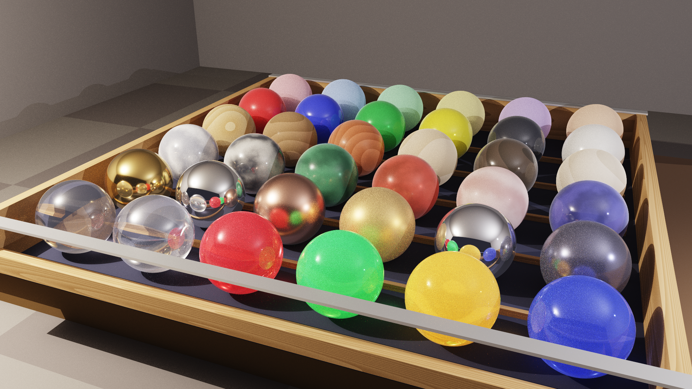

# 3D-Ray: High-Performance C# .NET 10 RayTracer Engine

[](https://dotnet.microsoft.com/)
[](https://dotnet.microsoft.com/)

[](https://opensource.org/licenses/MIT)
[](https://github.com/fiorenzobrioni/3d-ray/actions/workflows/dotnet.yml)

Un moderno motore di ray tracing ad alte prestazioni sviluppato in C# e .NET 10, con configurazione di scene tramite YAML e capacità di rendering avanzate basate su fisica (PBR).

> **English Description:** *A modern, parallelized ray-tracing engine built with C# and .NET 10, featuring YAML scene configuration and advanced physically-based rendering capabilities.*



---

## 🔍 Panoramica (Overview)

3D-Ray trasforma una descrizione YAML in un'immagine fotorealistica, senza dover scrivere codice. È pensato per chi vuole comporre scene ricche — interni, still life, paesaggi atmosferici, composizioni artistiche — sfruttando scene graph gerarchico con gruppi, trasformazioni e template, preset copia-incolla di materiali e luci, un BSDF Disney unificato che copre dal metallo spazzolato alle bolle di sapone, effetti volumetrici (nebbia, fumo, nubi) e illuminazione basata su HDRI.

Il motore è progettato per il calcolo parallelo multi-core, con BVH automatica, Next Event Estimation e campionamento Sobol per convergere in fretta, e chiude con un tone mapping ACES filmic per un look cinematografico.

Per la roadmap dettagliata, le feature in corso e quelle pianificate consulta il [**PLANNING**](./PLANNING.md); per lo storico dei cicli di sviluppo il [**DEVLOG**](./DEVLOG.md).

---

## ✨ Caratteristiche Principali (Key Features)

### Rendering
- 🚀 **Rendering Parallelo** — sfrutta tutti i core logici della CPU per una scalabilità lineare delle prestazioni.
- 🔁 **Path Tracing** con rimbalzi multipli configurabili: riflessi, rifrazioni, occlusione ambientale e color bleeding emergono naturalmente dalla simulazione fisica.
- 📷 **Camera con Depth of Field** — apertura e distanza di messa a fuoco configurabili per effetti bokeh fotorealistici.
- 🎬 **Multi-Camera** — più camere definite nella stessa scena, selezionabili da CLI per nome o indice per generare più inquadrature dallo stesso file YAML.
- 🎯 **Next Event Estimation con MIS** — campionamento diretto delle luci con Multiple Importance Sampling completo: tutti i materiali (Lambertian, Metal, Mix, Disney) e la phase function dei volumetrici partecipano. Balance heuristic di default, power heuristic opzionale via `--mis power`.
- 🧮 **Campionamento Stratificato** — riduce il rumore a parità di campioni totali.
- 🔢 **Sobol + Owen Scrambling** — sequenza quasi-Monte Carlo a bassa discrepanza che converge più in fretta del PRNG classico su pixel jitter, lens sampling e primi bounce.
- 🎲 **Russian Roulette** adattiva — terminazione stocastica dei raggi calibrata sull'illuminazione della scena per efficienza ottimale.
- 🎞️ **Tone Mapping ACES Filmic** — post-processing cinematografico con highlight naturali e colori ricchi.
- 🖼️ **Output multi-formato** — PNG, JPEG e BMP con rilevamento automatico dall'estensione del file.

### Accelerazione
- 📦 **BVH (Bounding Volume Hierarchy)** — struttura di accelerazione spaziale con **Surface Area Heuristic (SAH) a binning**, fat leaves e *ordered traversal*. Build parallelizzato per scene grandi. Intersezioni raggio-oggetto in tempo **O(log N)**, attivazione automatica in base alla complessità della scena.

### Geometrie
- ⚪ **Sphere** — sfera analitica
- 📦 **Box** — parallelepipedo allineato agli assi
- 🔩 **Cylinder** — cilindro finito con caps
- 🍦 **Cone** — cono finito o tronco di cono con caps
- 💊 **Capsule** — cilindro con estremità emisferiche
- 🍩 **Torus** — toro con intersezione analitica esatta
- ⭕ **Annulus** — disco con foro circolare (rondella)
- ⏺ **Disk** — disco piatto
- ▰ **Quad** — quadrilatero parametrico
- 🔺 **Triangle / SmoothTriangle** — triangolo con shading flat o interpolato per-vertex (Phong)
- ▬ **Infinite Plane** — piano infinito per pavimenti e sfondi
- 🏠 **Mesh (OBJ)** — modelli 3D da file Wavefront OBJ con smooth shading, UV mapping dell'artista e BVH interno dedicato
- 🏔️ **HeightField** — superficie di terreno continua intersecata analiticamente. La heightmap può essere un PNG-16 (output di `TerrainGen`) o sintetizzata da noise procedurale al caricamento. Supporta band di strata per altitudine e pendenza (sabbia/erba/roccia/neve), piano d'acqua opzionale e tutti i materiali del motore.
- 🔷 **CSG (Constructive Solid Geometry)** — operazioni booleane su solidi: **Union** (A ∪ B), **Intersection** (A ∩ B) e **Subtraction** (A \ B), annidabili ricorsivamente per forme arbitrariamente complesse
- 🏺 **Lathe (Superficie di Rivoluzione)** — profilo 2D fatto ruotare attorno all'asse Y per ottenere vasi, calici, colonne e lampade senza tassellatura. Tre modalità di profilo: **linear** (segmenti con spigoli netti, look tornito), **Catmull-Rom** (curva liscia che passa per ogni punto) e **Bezier cubico** (control point manuali).
- 🪚 **Extrusion (Estrusione lineare di un profilo 2D)** — profilo 2D chiuso fatto scorrere lungo l'asse Y per ottenere prismi a sezione qualunque: stelle, ingranaggi, lettere, scudi, profilati architettonici, sezioni a L/U/T/H, washer, medaglioni. **I profili concavi sono supportati** grazie alla triangolazione automatica delle facce di chiusura. Stesse tre modalità del Lathe (**linear**, **Catmull-Rom**, **Bezier**) più due modificatori opzionali: **twist** (rotazione del profilo lungo l'altezza) e **taper** (rastremazione della sezione superiore) per colonne attorcigliate, raccordi industriali e forme che combinerebbero altrimenti più operatori in un editor 3D.

### Struttura della Scena
- 🌳 **Scene Graph (Gruppi)** — Composizione gerarchica di oggetti con trasformazioni ereditate. Gruppi annidabili con primitive, CSG, mesh e altri gruppi.
- 🏭 **Template / Istanze** — Definisci oggetti composti una volta come template, istanzia N volte con trasformazioni e materiali indipendenti. Librerie di oggetti importabili da file YAML separati.
- 📦 **Import YAML** — Scomposizione di scene complesse in file separati. Librerie riutilizzabili di materiali, template, oggetti e luci con import annidati e protezione ciclica.
### Materiali
- 🎨 **Lambertian** — diffuso opaco
- 🪞 **Metal** — riflesso speculare con rugosità (`fuzz`) configurabile
- 💎 **Dielectric** — vetro e trasparenti con rifrazione e riflesso Fresnel
- 💡 **Emissive** — materiale auto-luminoso; gli oggetti emissivi partecipano automaticamente alla NEE come sorgenti di luce geometriche
- 🌟 **Disney Principled BSDF** — materiale PBR unificato (`"disney"` / `"pbr"`): un singolo tipo copre plastica, metallo, vetro, vernice auto, tessuto, pelle, bolle di sapone e qualsiasi combinazione. Oltre ai parametri classici (`metallic`, `roughness`, `specular`, `sheen`, `clearcoat`, `spec_trans`, `ior`) supporta:
  - **Anisotropia** per highlight allungati stile metallo spazzolato, capelli e vinile.
  - **Multi-scattering energy compensation** per metalli rugosi convincenti (oro e rame anche a roughness alta).
  - **Beer-Lambert per il vetro** con assorbimento dipendente dallo spessore: liquori, bottiglie colorate, acque profonde.
  - **Diffuse transmission & thin-walled** per fogli, foglie, tendaggi e paralumi.
  - **Subsurface shaping** con tinte sotto-pelle dedicate per pelle, cera e marmo.
  - **Clearcoat avanzato** con IOR e normal map proprie per carrozzerie, lacche e vinile protetto.
  - **Charlie sheen** per microfibre realistiche (velluto, pesca, muschio).
  - **Thin-film iridescence** per bolle di sapone, opal e rivestimenti dicroici.

  Dettagli matematici e riferimenti bibliografici in [`docs/technical/shading-model.md`](./docs/technical/shading-model.md).
- 🔀 **Mix Material** — blending tra due materiali qualsiasi con peso costante o texture mask spaziale (noise, marble, image…). Per effetti di ruggine, usura, transizioni graduali, decal e composizioni ricorsive (mix-of-mix)

### Texture
- ♟ **Checker** — scacchiera 3D procedurale
- 🌀 **Noise** — rumore Perlin (liscio o turbolento) con `noise_type`, `octaves`, `lacunarity`, `gain`, `distortion`; modalità `perlin` / `fbm` / `turbulence` / `ridged` / `billow` più i due multifrattali **Musgrave** `hetero_terrain` e `hybrid_multifractal` per terreni erosi e roccia stratificata
- 🏔 **Marble** — marmo procedurale realistico con venature multi-strato, distorsione che elimina il tiling visibile, pieghe geologiche, variazione cromatica di fondo e impurità minerali.
- 🪵 **Wood** — legno procedurale realistico con anelli di crescita asimmetrici e variabili, venatura e figure del taglio, pori, gradiente alburno/durame e nodi. Il pattern degli anelli può pilotare anche `roughness` e `sheen` del Disney BSDF.
- 🔷 **Voronoi / Worley** — pattern cellulari con dieci canali di output e metriche euclidean/manhattan/chebyshev, ideali per rocce, scaglie, mosaici e ciottoli. Colore per-cella libero o pilotato da palette/color ramp, con bordi netti o ammorbiditi (`smoothness`).
- 🧱 **Brick** — pattern mattoni running-bond con variazione per-mattone e weathering
- 🌈 **Gradient** — sfumature lineari, quadratiche, easing, sferiche e radiali
- 🖼 **Image Texture** — texture da file (PNG, JPEG, BMP, GIF, TIFF, WebP) con bilinear filtering, tiling configurabile e **mipmap pyramid + EWA anisotropic filtering** per niente moiré né shimmer a basso angolo o a 4K
- 🗺 **Normal Map** — dettaglio geometrico superficiale senza triangoli aggiuntivi; compatibile OpenGL e DirectX-style (`flip_y`)
- 🎨 **Color Ramp multi-stop** — blocco `color_ramp:` opzionale che sostituisce il lerp implicito a due colori su noise/marble/wood/voronoi/gradient. Stop multipli a posizione libera con quattro modi di interpolazione (linear, smoothstep, ease, constant): marmi a 3+ toni, sapwood/heartwood, gradienti sunset, toon bands, heat-map.
- 🧭 **Coordinate** — ritorna le coordinate del punto di shading come RGB nei quattro spazi canonici (`object`, `uv`, `generated`, `world`). Due usi: overlay di debug visivo (UV unwrap, allineamento object/world space) e driver XYZ deterministico per pilotare un'altra texture via mix material.

Tutte le texture procedurali supportano **offset**, **rotation** e **randomizzazione per-oggetto** tramite seed deterministico.

### Texture Filtering (Anti-Aliasing Analitico)
- 🔬 **Ray differentials + filter footprint** — ogni raggio porta le derivate screen-space propagate analiticamente attraverso le primitive e le `Transform`. Le procedurali pre-integrano il loro contributo invece di point-sampleare:
  - **Perlin / fBm / Musgrave** — clamp ottave sopra la frequenza di Nyquist
  - **Voronoi** — supersampling adattivo 1/4/9/16 sample sul footprint
  - **Image** — mipmap pyramid + EWA filtering anisotropico
  
  Risultato: niente shimmer/moiré a distanza, niente alias a basso angolo, nessun trucco di supersampling globale. Attivabile/disattivabile via `--texture-filtering auto|on|off`.

### Surface Displacement Stack
- 🟢 **Bump map** — dettaglio di superficie ottenuto perturbando la normale di shading da una texture qualunque (procedurale o image), senza aggiungere geometria. Disponibile su ogni materiale e su tutte le primitive.
- 🔺 **Mesh subdivision** — raffinamento delle mesh OBJ con gli algoritmi Loop (mesh triangolari) e Catmull-Clark (mesh quad/miste), in modalità uniforme o adattiva screen-space.
- 🎯 **Displacement material-level** — il blocco `displacement` vive sul material: un material displaced guida tutte le mesh che lo referenziano, senza duplicazione per-entity. Tri-state `displacement_method: both | displacement | bump_only` e bypass per-istanza con `displacement_enabled: false`.
- 🏔️ **Scalar displacement** — deformazione reale della mesh subdivisa lungo la normale: cambia la silhouette dell'oggetto, non solo lo shading.
- 🗿 **Vector displacement** — offset 3D dei vertici letto dal triplet RGB della texture, in tangent space o object space. Permette overhang, pieghe e dettagli che si ripiegano su sé stessi.
- ✨ **Autobump** — bump residuo derivato automaticamente dalla stessa texture di displacement, recupera la frequenza alta che la griglia di subdivision non riesce a rappresentare.
- 🧬 **Mix-displacement** — un `MixMaterial` con `displacement: { blend_with_mask: true }` vector-blenda i displacement dei due child con la stessa mask del BSDF, C0-continuo lungo le cuciture; l'autobump risultante compone i due autobump children via `MixBumpMapTexture`.

### Sistema di Trasformazione
- 🔄 **Transform** — scala, rotazione e traslazione applicabili a qualsiasi primitiva, inclusi i nodi CSG.

### Sistema di Illuminazione
- 💡 **Point Light** — luce puntiforme con attenuazione quadratica
- ☀️ **Directional Light** — luce parallela (sole), senza attenuazione
- 🔦 **Spot Light** — faretto con cono interno/esterno e falloff liscio
- 🟧 **Area Light** — emettitore rettangolare con soft shadows fisicamente corretti via campionamento Monte Carlo
- 🟡 **Sphere Light** — luce sferica con solid-angle sampling: penumbra circolare uniforme e zero campioni sprecati. Ideale per lampadine, lanterne e globi luminosi.
- ✨ **Emissive Objects** — qualsiasi geometria con materiale `emissive` diventa sorgente di luce visibile con illuminazione indiretta naturale
- 🌐 **Environment Light** — flat / gradient / Hosek-Wilkie / HDRI sky partecipano tutti alla NEE; analytical sun di gradient e physical sky è disaccoppiato in un `PhysicalSun` indipendente che si combina con qualunque sky body.

### Ambiente
- ☁️ **Flat Sky** — cielo a colore uniforme. Default `[0.5, 0.7, 1.0]` quando `world.sky` è omesso; partecipa a NEE quando luminanza > 0.
- 🌅 **Gradient Sky** — cielo procedurale con gradiente verticale a 3 bande (zenith, orizzonte, terreno) e sole analitico opzionale agganciato a un `PhysicalSun` con cone sampling stratificato e limb darkening fisicamente corretto.
- ☀️ **Physical Sky (Preetham/Hosek-Wilkie)** — daylight analitico parametrizzato da `turbidity` e `ground_albedo`. `type: hosek_wilkie` o `type: preetham`.
- 🌌 **Nishita Sky** — atmosfera fisica Rayleigh+Mie con LUT trasmittanza precomputata e integrazione single-scattering. Alba e tramonto fisicamente corretti: disco rosso, halo arancione e zenith blu emergono dalla simulazione fisica, non da fitting.
- 🪟 **Portal Light** — finestra/lucernario sull'environment. Restringe la NEE al rettangolo del portal per ridurre significativamente la varianza negli interni. `type: portal` con `anchor + u + v`.
- 🔍 **HDRI mipmap prefiltering** — pyramid energia-conservativa su equirectangolare con interpolazione trilineare. Il LOD viene derivato automaticamente dalla distribuzione del BSDF per ridurre i firefly sulle riflessioni glossy di HDRI con picchi molto luminosi.
- 🌫️ **Aerial perspective (Nishita medium)** — `world.medium.type: atmosphere` riusa le costanti Rayleigh + Mie del NishitaSky per attenuare la geometria distante con la stessa fisica che genera il colore del cielo. Da abbinare a `sky.type: nishita` per coerenza fotorealistica.
- 🌍 **IBL / HDRI** — Image-Based Lighting da file Radiance `.hdr` o OpenEXR `.exr`, CDF 2D luminance-weighted, MIS bilancia escape / NEE. **Sun extractor** opzionale: rileva il picco luminoso, in-painta la HDRI e splitta il sole in un `PhysicalSun` separato per ombre nitide e meno fireflies.
- 🎛️ **Visibility flags** — `camera / diffuse / glossy / transmission / shadow` indipendenti, plus `sun.visible_to_camera` per nascondere il disco dalla camera lasciandolo come sorgente luminosa.
- 🖼️ **Background plate** — `background:` sub-block opzionale: illumina la scena con un'HDRI e mostra alla camera una plate diversa.
- 🧭 **Orientation** quaternion / Euler XYZ — sostituisce il vecchio `rotation:` solo-Y.
- 🏞️ **Ground production-grade** — terreno dedicato con quattro forme (piano infinito, quad, disco, heightfield), posizione e normale configurabili, materiale Disney inline (`color`/`roughness`/`metallic`), UV transform completa, flag di visibilità per categoria di raggio e auto-sync dell'albedo con il cielo quando il materiale è omesso.

### Volumetria (Participating Media)
- 🌫️ **Homogeneous Medium** — mezzo partecipante uniforme globale per nebbia densa, foschia e effetti subacquei. Beer-Lambert analitico, economico, adatto come base di partenza.
- 🏔️ **Height Fog** — foschia atmosferica con densità che cala esponenzialmente con la quota (`scale_height`, `y0`). Modello "aerial perspective" per scene outdoor: montagne, strade all'alba, vedute urbane.
- 🌀 **Procedural Medium (Perlin fBm)** — nebbia eterogenea generata da rumore Perlin multi-ottava con delta tracking e ratio tracking. Sacche di densità irregolari, god-ray non omogenei, atmosfere da film horror o nubi sparse.
- 🧊 **Grid Medium** — densità campionata su griglia 3D regolare (inline YAML o file binario `.vol`) confinata in una AABB world-space, con filtro di ricostruzione selezionabile: **trilineare** (default, veloce) o **tricubico** Catmull-Rom (più liscio) per rimuovere i kink visibili sulle griglie a bassa risoluzione. Ideale per fumo localizzato, esplosioni, nuvole isolate.
- 🎇 **Cinque phase function** — `isotropic` (scattering uniforme), `hg` (Henyey-Greenstein, asimmetria direzionale), `rayleigh` (scattering atmosferico), `double_hg` (due lobi misti per nubi realistiche) e `schlick` (approssimazione fast-HG). Ogni mezzo combinabile con qualsiasi phase function.
- 🧬 **MediumInterface per-entity** — mezzi nominati assegnati alle singole entity (`interior_medium` / `exterior_medium`): nebbia locale in una stanza, fumo in una teiera, acqua in un acquario, atmosfera di un pianeta — senza riempire l'intera scena. Gestisce correttamente volumi trasmissivi annidati, come un vetro che contiene un liquido.
- 🪨 **Subsurface scattering volumetrico (Random Walk)** — diffusione sotto-superficie fisica per marmo, pelle, cera, latte e giada via `interior_medium`. Preset di qualità `preview / normal / high` ereditati da `--quality`, con controllo fine via `--sss-mode`, `--sss-quality` e `--max-volume-bounces`.
- 🧪 **Material-embedded SSS (`subsurface_radius`)** — SSS volumetrico dichiarato direttamente sul materiale Disney: basta indicare `subsurface_radius` (più gli opzionali `subsurface_color`, `subsurface_scale`, `subsurface_anisotropy`) e il motore costruisce e applica automaticamente il mezzo interno alle entity che usano il materiale. I preset (marmi traslucidi, cere, ghiacci, latte, cioccolato, opali, pelle, ametiste) ne fanno uso: basta incollare il preset per avere SSS volumetrico senza configurazione aggiuntiva.

---

## 🚀 Quick Start

### Prerequisiti
- [.NET 10 SDK](https://dotnet.microsoft.com/download/dotnet/10.0)

> I comandi qui sotto sono `dotnet` standard: funzionano identici su bash, zsh e PowerShell.

### Compilazione
```bash
cd 3d-ray
dotnet build src/RayTracer/RayTracer.csproj -c Release
```

### Esecuzione

Sanity check istantaneo (preset `draft-tiny`, 480×270 — pochi secondi):
```bash
dotnet run --project src/RayTracer/RayTracer.csproj -c Release -- -i scenes/pendolo-newton -q draft-tiny -o renders/render-sanity.png
```

Render di prova rapido (preset `draft-small`, 960×540):
```bash
dotnet run --project src/RayTracer/RayTracer.csproj -c Release -- -i scenes/pendolo-newton -q draft-small -o renders/render-draft.png
```

Render finale Full HD (preset `final`, 1920×1080, qualità portfolio):
```bash
dotnet run --project src/RayTracer/RayTracer.csproj -c Release -- -i scenes/pendolo-newton -q final -o renders/render-final.png
```

Render finale 4K (preset `ultra`, 3840×2160):
```bash
dotnet run --project src/RayTracer/RayTracer.csproj -c Release -- -i scenes/pendolo-newton -q ultra -o renders/render-4k.png
```

Render classico con parametri espliciti — il vecchio modo continua a funzionare e ogni flag esplicito vince comunque sul preset (es. `-q final -d 16` per scene con vetri impilati):
```bash
dotnet run --project src/RayTracer/RayTracer.csproj -c Release -- -i scenes/pendolo-newton -s 1024 -d 8 -S 4 -o renders/render-final.png -w 1920 -H 1080
```

> **Nota — estensione `.yaml` opzionale:** il flag `-i` accetta sia il percorso completo (`scenes/pendolo-newton.yaml`) sia la versione senza estensione (`scenes/pendolo-newton`). Quando l'estensione è omessa, il loader prova ad aggiungere automaticamente `.yaml` e poi `.yml`. Gli esempi in questo README usano la forma compatta senza estensione.

> Per i profili completi (Preview / Standard / Final), i tip su `-d`, `-s`, `-S`, `-C` e la compensazione fotografica `--exposure` consulta la guida [Profili di Rendering](./docs/reference/profili-di-rendering.md) ([English version](./docs/reference/rendering-profiles.md)).

---

## 📁 Struttura del Progetto

```
3d-ray/
├── docs/                    # Documentazione del progetto
│   ├── reference/           # Riferimento YAML completo (EN/IT)
│   ├── technical/           # Approfondimenti tecnici interni
│   └── tutorial/            # Tutorial in 12 capitoli (EN/IT)
│       ├── en/              # Tutorial in English
│       └── it/              # Tutorial in italiano
├── src/
│   ├── RayTracer/              # Motore principale
│   │   ├── Acceleration/       # BVH
│   │   ├── Camera/             # Camera con DOF
│   │   ├── Core/               # Ray, HitRecord, MathUtils, sampling
│   │   ├── Geometry/           # Primitive (Sphere, Box, Cylinder, CsgObject, Group...)
│   │   ├── Lights/             # Point, Directional, Spot, Area, Sphere, GeometryLight, EnvironmentLight
│   │   ├── Materials/          # Lambertian, Metal, Dielectric, Emissive, Disney BSDF, MixMaterial
│   │   ├── Rendering/          # Renderer, SkySettings, EnvironmentMap
│   │   ├── Scene/              # SceneLoader, SceneData
│   │   ├── Textures/           # Checker, Noise, Marble, Wood, Image, NormalMap
│   │   └── Volumetrics/        # Homogeneous, HeightFog, Procedural, GridMedium e phase function
│   ├── RayTracer.Tests/        # Suite xUnit (equivalenza BVH, AABB, ...)
│   ├── RayTracer.Benchmarks/   # Harness BenchmarkDotNet
│   └── Tools/
│       ├── TerrainGen/         # Generatore di Terrain heightfield stratificati
│       ├── FontGen/            # Generatore di font 3D partendo da font di sistema o file .ttf/.otf
│       ├── TextureGen/         # Generatore texture procedurali (PNG)
│       ├── NormalMapGen/       # Generatore flat normal map per test
│       ├── ChessGen/           # Generatore scena scacchiera chess.yaml
│       └── TempleGen/          # Generatore scena tempio-romano.yaml
├── scenes/                     # File YAML di scene
│   ├── presets/                # Cataloghi copia-incolla: materiali, luci, mediums, cielo/terreno, terreni
│   ├── assets/                 # Risorse binarie
│   │   ├── textures/           # Texture PNG (albedo e normal map)
│   │   ├── fonts/              # Template caratteri 3D per extrusion (generati da FontGen)
│   │   └── heightmaps/         # Heightmap PNG-16 (generate da TerrainGen)
│   ├── showcases/              # Scene dimostrative per singola feature
│   └── *.yaml                  # Scene principali del progetto
├── renders/                    # Immagini renderizzate
└── .github/workflows/          # CI con smoke test
```

---

## 🛠️ Tool Inclusi

### TextureGen
Genera texture procedurali pronte all'uso (mattoni, legno, marmo, griglia UV):
```bash
dotnet run --project src/Tools/TextureGen/TextureGen.csproj
```

### NormalMapGen
Genera una normal map piatta per testare il sistema di normal mapping:
```bash
dotnet run --project src/Tools/NormalMapGen/NormalMapGen.csproj
```

### FontGen
Genera template di caratteri 3D da font di sistema o file `.ttf`/`.otf`, pronti per la primitiva `extrusion`. Supporta serif, sans-serif e display font; il flag `--list-fonts` elenca i font installati sulla macchina.
```bash
dotnet run --project src/Tools/FontGen/FontGen.csproj -c Release -- --font "Times New Roman"
dotnet run --project src/Tools/FontGen/FontGen.csproj -c Release -- --font "Impact" --chars "ABC123"
```
Output: `scenes/assets/fonts/font-<nome>.yaml`

### ChessGen
Genera il file YAML di una scacchiera Staunton completa (board 8×8 + 32 pezzi posizionati con trasformazioni). Usato per produrre `scenes/chess.yaml`:
```bash
dotnet run --project src/Tools/ChessGen/ChessGen.csproj
```

### TempleGen
Genera il file YAML di un tempio romano dettagliato con colonne scanalate (`extrusion`), frontone, celle CSG e materiali PBR. Usato per produrre `scenes/tempio-romano.yaml`:
```bash
dotnet run --project src/Tools/TempleGen/TempleGen.csproj
```

### TerrainGen
Genera una heightmap PNG-16 e il corrispondente template YAML pronto per `type: heightfield`. Supporta tipi di terreno diversi, idrologia (fiumi, laghi, mare, isole), stagioni e band di strata (sabbia/erba/roccia/neve). Con `--with-cameras` aggiunge anche una scena di preview pronta al render.
```bash
dotnet run --project src/Tools/TerrainGen/TerrainGen.csproj -- \
  --name <stem> --type pianura|collina|montagna \
  --include fiumi,laghi,mare,isole --season primavera|estate|autunno|inverno \
  [--seed N] [--size U] [--resolution N] [--with-cameras]
```
Output: `scenes/assets/heightmaps/<stem>-height.png` + `scenes/assets/heightmaps/<stem>.yaml`  
Con `--with-cameras`: anche `scenes/<stem>-preview.yaml` (scena pronta al render con cinque camere).

---

## 📖 Guida all'Uso e CLI

### Parametri CLI

| Parametro | Alias | Default | Descrizione |
|-----------|-------|---------|-------------|
| `--input` | `-i` | — (**obbligatorio**) | Percorso del file YAML della scena. L'estensione `.yaml` (o `.yml`) è **opzionale**: se il path non esiste così com'è, il loader prova ad aggiungerla automaticamente (es. `-i scenes/chess` ⇒ `scenes/chess.yaml`). |
| `--output` | `-o` | `renders/render-<scena>.png` | File di output. Se omesso, generato dal nome della scena. |
| `--quality` | `-q` | — | Preset di qualità che riempie in un colpo `-w -H -s -d -S`. Valori: `draft-tiny` (480×270), `draft-small` (960×540), `draft` (1080p) — `medium-tiny`, `medium-small`, `medium` — `final-tiny`, `final-small`, `final` — `ultra` (4K). **Qualunque flag esplicito vince sul preset** (es. `-q final -d 16` per scene con vetri impilati). Vedi i [Profili di Rendering](./docs/reference/profili-di-rendering.md). |
| `--width` | `-w` | `1200` | Larghezza in pixel. |
| `--height` | `-H` | `800` | Altezza in pixel. |
| `--samples` | `-s` | `16` | Campioni per pixel. Con il sampler Sobol (default) viene usato il conteggio esatto; con `--sampler prng` viene arrotondato al quadrato perfetto superiore (`√N × √N`). |
| `--depth` | `-d` | `8` | Massimo numero di rimbalzi ricorsivi per raggio. Alza a `16+` solo per dielettrici impilati (vetri annidati, liquidi nei bicchieri). |
| `--shadow-samples` | `-S` | *(da YAML)* | Override globale dei shadow samples per tutte le area light. Usa quadrati perfetti (`1, 4, 9, 16`). |
| `--clamp` | `-C` | `100` | Firefly clamp: massima radianza per-campione prima del tone mapping. Abbassa (es. `25`) per scene problematiche con vetri/nebbia, alza per highlight molto intensi. |
| `--indirect-clamp-factor` | — | `1.0` | Fattore di clamp per i bounce indiretti (depth ≥ 1). `1.0` = disabilitato (default). `0.25` → clamp indiretto = 25 se `-C 100`. |
| `--exposure` | — | `0` EV | Compensazione fotografica in stop, applicata come `2^EV` **prima** del tone map ACES. Negativo scurisce (`-1` = ½, `-2` = ¼), positivo schiarisce. Usalo per scivolare scene troppo luminose nella sweet-spot lineare di ACES dove il contrasto delle texture resta visibile. |
| `--camera` | `-c` | *(prima camera)* | Seleziona la camera per nome o indice (0-based). |
| `--sampler` | — | `sobol` | Campionatore per-pixel: `sobol` (Owen-scrambled, default) o `prng` (legacy thread-local). Nessuna differenza di interfaccia scena: cambia solo la sequenza dei numeri casuali. |
| `--mis` | — | `balance` | Heuristica MIS che combina Light Sampling (NEE) e BSDF/Phase Sampling: `balance` o `power` (β=2). Stesso costo computazionale; `power` riduce ulteriormente la varianza quando le PDF disagree (luce piccola + materiale ruvido, sole nella nebbia). |
| `--light-sampling` | — | `all` | Strategia NEE: `all` = somma tutte le luci (default, backward compat); `power` = campiona una luce ∝ `ApproximatePower` (varianza minore in scene multi-luce); `uniform` = campionamento uniforme (debug). |
| `--texture-filtering` | — | `auto` | Anti-aliasing analitico delle texture procedurali e image via ray differentials: `auto`/`on` = filtering attivo (Perlin/fBm octave clamp, Voronoi supersampling adattivo, image mipmap + EWA anisotropico); `off` = point-sampled puro (utile come baseline per benchmark/AB). |
| `--sss-mode` | — | `auto` | Dispatch del random walk subsurface scattering: `auto` (default) — i media bound a entità con `σ_s > 0` attivano il walk; `off` — i media pushati sono declassati ad assorbimento solo (Beer-Lambert legacy), utile per preview rapide e A/B comparison. |
| `--sss-quality` | — | da `-q` | Preset random-walk: `preview` (16 vol-bounce, no NEE in-walk), `normal` (64, NEE on), `high` (256, NEE on). Se omesso, ereditato dal preset `-q` (`draft*` → preview, `medium*` → normal, `final*`/`ultra` → high). |
| `--max-volume-bounces` | — | da `--sss-quality` | Cap massimo sui bounce del random walk in un'entità. Override del valore del preset, utile per stress test su media densi (`--max-volume-bounces 16`) o per qualità extra (`--max-volume-bounces 512`). |
| `--list-cameras` | — | — | Elenca le camere disponibili nella scena ed esce. |
| `--verbose` | `-v` | — | Mostra informazioni dettagliate durante il caricamento e l'analisi della scena (import, template, σ del medium, tuning Russian Roulette). Utile per debug e sviluppo scene. |
| `--help` | `-h` | — | Mostra il messaggio di aiuto ed esce. |

> **Nota:** `-H` è maiuscola perché `-h` è riservato a `--help`. Le maiuscole sono usate per gli "override avanzati": `-S` (`--shadow-samples`) e `-C` (`--clamp`); `-s` minuscola per `--samples`, `-c` minuscola per `--camera`.

> **Profili di rendering pronti all'uso:** vedi [Profili di Rendering](./docs/reference/profili-di-rendering.md) · [Rendering Profiles (EN)](./docs/reference/rendering-profiles.md).

---

## 💡 Esempi Pratici

### Preset `draft-tiny` (sanity check istantaneo — 480×270)
```bash
dotnet run --project src/RayTracer/RayTracer.csproj -- -i scenes/chess -q draft-tiny -o sanity.png
```

### Preset `draft-small` (composizione, camere, materiali — secondi, 960×540)
```bash
dotnet run --project src/RayTracer/RayTracer.csproj -- -i scenes/chess -q draft-small -o preview.png
```

### Preset `medium` (CI/CD, review, log — minuti, 1920×1080)
```bash
dotnet run --project src/RayTracer/RayTracer.csproj -- -i scenes/chess -q medium -o draft.png
```

### Preset `final` (portfolio, copertina README — Full HD)
```bash
dotnet run --project src/RayTracer/RayTracer.csproj -- -i scenes/chess -q final -o final.png
```

### Preset `ultra` (4K showcase)
```bash
dotnet run --project src/RayTracer/RayTracer.csproj -- -i scenes/chess -q ultra -o cover-4k.png
```

### Preset + override (il flag esplicito vince)
Lancia il preset `final` ma alza la depth a 16 per una scena con vetri impilati:
```bash
dotnet run --project src/RayTracer/RayTracer.csproj -- -i scenes/chess -q final -d 16 -o glass-final.png
```

### Parametri classici (senza preset)
Tutti i flag puoi continuare a passarli a mano: utile per profili custom o per regression test che non devono dipendere dai preset.
```bash
# Profilo Final ricreato a mano
dotnet run --project src/RayTracer/RayTracer.csproj -- -i scenes/chess -o final.png -w 1920 -H 1080 -s 1024 -d 8 -S 4

# Profilo Standard tile orizzontale 800×533
dotnet run --project src/RayTracer/RayTracer.csproj -- -i scenes/chess -o draft.png -w 800 -H 533 -s 256 -d 6
```

### Output in JPEG
Il formato viene rilevato automaticamente dall'estensione:
```bash
dotnet run --project src/RayTracer/RayTracer.csproj -- -i scenes/chess -q medium -o render.jpg
```

### Multi-Camera
```bash
dotnet run --project src/RayTracer/RayTracer.csproj -- -i scenes/chess --list-cameras
dotnet run --project src/RayTracer/RayTracer.csproj -- -i scenes/chess -q final -c top -o top.png
dotnet run --project src/RayTracer/RayTracer.csproj -- -i scenes/chess -q final -c 2 -o cam2.png
```

> **Nota:** in tutti questi esempi `-i scenes/chess` equivale a `-i scenes/chess.yaml` — l'estensione `.yaml` (o `.yml`) è opzionale e viene aggiunta automaticamente dal loader se il file non viene trovato così com'è.

---

## 📖 Documentazione e Guide (Documentation)

### 📚 Tutorial

Guida completa in 12 capitoli: dalla teoria del ray tracing alla creazione di scene di produzione con materiali PBR, illuminazione avanzata, CSG, volumetria, preset e progetti, superfici di rivoluzione (lathe) ed estrusioni di profili 2D (extrusion). Disponibile in inglese e italiano.  
*12-chapter guide from ray tracing theory to production scenes with PBR materials, advanced lighting, CSG, volumetrics, presets and projects, surfaces of revolution (lathe) and 2D-profile extrusions (extrusion). Available in English and Italian.*

[EN](./docs/tutorial/en/README.md) · [IT](./docs/tutorial/it/README.md) · [Indice bilingue / Bilingual index](./docs/tutorial/README.md)

### 📋 Reference

Riferimento tecnico completo di ogni chiave YAML accettata dal motore: world, camera, materiali, primitive, luci, CSG, import e template. Disponibile in inglese e italiano.  
*Complete technical reference for every YAML key the engine accepts: world, camera, materials, primitives, lights, CSG, imports, and templates. Available in English and Italian.*

[EN](./docs/reference/scene-reference.md) · [IT](./docs/reference/riferimento-scene.md) · [Indice bilingue / Bilingual index](./docs/reference/README.md)

**Profili di Rendering / Rendering Profiles** — guida pratica ai parametri CLI di qualità render (`-s`, `-d`, `-S`, `-C`) con tre profili canonici (Preview / Standard / Final) e tip per non sprecare tempo di render.  
*Practical guide to the render-quality CLI parameters (`-s`, `-d`, `-S`, `-C`) with three canonical profiles and tips for avoiding wasted render time.*

[EN](./docs/reference/rendering-profiles.md) · [IT](./docs/reference/profili-di-rendering.md)

---

## 📖 Documentazione Tecnica

Per chi vuole approfondire gli aspetti matematici e le scelte implementative:

- [**Pipeline di Rendering**](./docs/technical/rendering-pipeline.md) — Flusso completo dall'YAML al pixel: inizializzazione, scene analysis, TraceRay e post-processing.
- [**Modello di Shading e Materiali**](./docs/technical/shading-model.md) — Disney BSDF, Fresnel (Schlick) e Normal Mapping (TBN).
- [**Path Tracing e Illuminazione**](./docs/technical/path-tracing-and-lighting.md) — NEE, Russian Roulette, campionamento HDRI e Sphere Light.
- [**Multiple Importance Sampling (MIS)**](./docs/technical/multiple-importance-sampling.md) — Estimatore di Veach, heuristiche balance/power, contratti `Sample`/`Pdf`/`Evaluate` e casi limite (lobi delta, MixMaterial, phase function in volumi).
- [**Strutture di Accelerazione (BVH)**](./docs/technical/acceleration-structures.md) — Bounding Volume Hierarchy e SAH.
- [**Geometria del Toro e Risolutore di Quartiche**](./docs/technical/quartic-solver-and-torus.md) — Intersezione analitica raggio-toro e metodo di Ferrari.
- [**CSG — Constructive Solid Geometry**](./docs/technical/csg-boolean-operations.md) — Algoritmo di classificazione a intervalli, gestione delle normali e alberi booleani annidati.
- [**Benchmark (`RayTracer.Benchmarks`)**](./docs/technical/benchmarks.md) — Harness BenchmarkDotNet per AABB e BVH: esecuzione, output, aggiunta di nuovi benchmark.
- [**Testing (`RayTracer.Tests`)**](./docs/technical/testing.md) — Suite xUnit: test di equivalenza BVH ↔ HittableList, differenziali AABB, pattern riusabili.

---

## 🤖 Collaborazione AI

Questo progetto è stato sviluppato con il supporto di tecnologie di Intelligenza Artificiale agentica e modelli di linguaggio avanzati:


---

## 📄 Licenza

Questo progetto è distribuito sotto licenza **MIT**. Consulta il file [LICENSE](LICENSE) per i dettagli.
