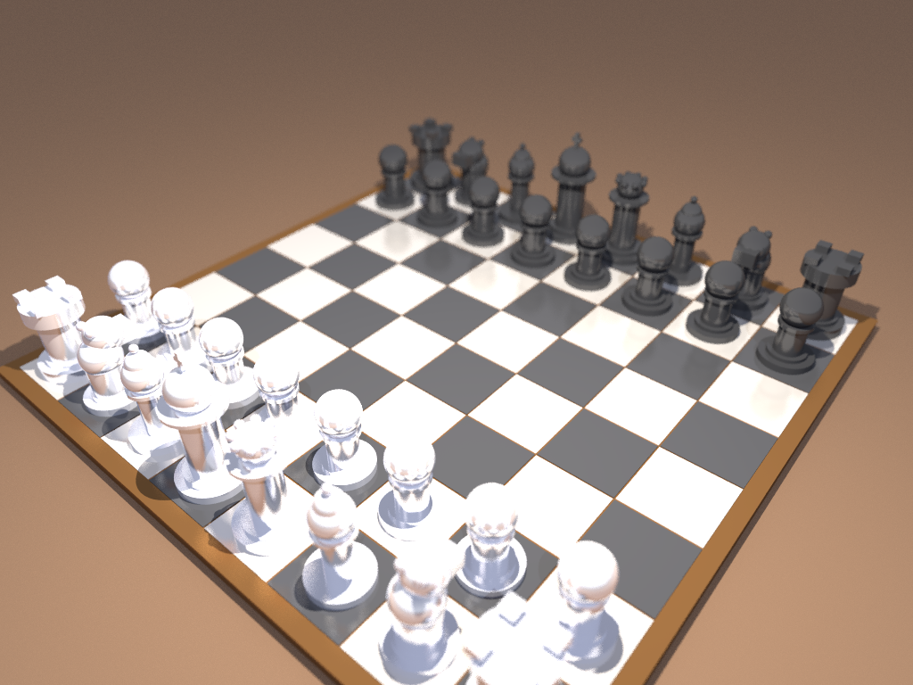

# 3D-Ray: High-Performance .NET 10 RayTracer Engine
A modern, parallelized ray-tracing engine built with C# and .NET 10, featuring YAML scene configuration and advanced rendering capabilities.



---

## 🔍 Panoramica (Overview)
**3D-Ray** è un motore di rendering ray-tracing ad alte prestazioni sviluppato in C# su piattaforma .NET 10. È progettato per ricercatori, sviluppatori e appassionati di computer grafica che necessitano di uno strumento flessibile e potente per generare immagini fotorealistiche partendo da descrizioni testuali delle scene. Il software risolve il problema della visualizzazione di geometrie complesse e materiali fisicamente basati (PBR) attraverso un'architettura modulare e ottimizzata per il calcolo parallelo.

---

## ✨ Caratteristiche Principali (Key Features)
- 🚀 **Rendering Parallelo**: Sfrutta tutti i core logici della CPU tramite `Parallel.For` per una scalabilità lineare delle prestazioni.
- 📦 **Acceleration Structure**: Implementazione di **BVH (Bounding Volume Hierarchy)** per ridurre drasticamente la complessità computazionale del test di intersezione raggio-oggetto.
- 📐 **Primitive Geometriche**: Supporto per Sfere, Piani infiniti, Scatole (Box), Triangoli e Cilindri.
- 💎 **Materiali Avanzati**: Modelli fisici per materiali Lambertiani (opachi), Metalli (con parametro di *fuzziness*) e Dielettrici (rifrazione del vetro con indice di rifrazione variabile).
- 📸 **Camera Realistica**: Supporto per Field of View (FOV) regolabile, profondità di campo (Depth of Field) tramite apertura e distanza focale.
- 💡 **Sistema di Illuminazione**: Supporto per luci puntiformi e direzionali con calcolo delle ombre.
- 📄 **Configurazione YAML**: Definizione completa della scena (oggetti, materiali, luci, camera) tramite file YAML strutturati.

---

## 🛠️ Stack Tecnologico
- **Linguaggio**: C# 13 / .NET 10
- **Librerie Core**:
  - `SixLabors.ImageSharp`: Per la manipolazione e il salvataggio delle immagini in vari formati.
  - `YamlDotNet`: Per il parsing dei file di configurazione delle scene.
  - `System.Numerics`: Per il calcolo vettoriale ottimizzato (SIMD).

---

## 🚀 Installazione e Compilazione

### Prerequisiti
- **.NET 10 SDK** (o versione successiva) installato sul sistema.

### Compilazione
Clona il repository e compila il progetto utilizzando la CLI di .NET:

```powershell
# Naviga nella cartella del progetto
cd 3d-ray

# Ripristina le dipendenze e compila
dotnet build src/RayTracer/RayTracer.csproj -c Release
```

---

## 📖 Guida all'Uso (Usage) e CLI

Per avviare il renderer, è possibile utilizzare il comando `dotnet run`. I parametri devono essere passati dopo il separatore `--`.

### Parametri CLI

| Parametro | Alias | Default | Descrizione |
|-----------|-------|---------|-------------|
| `--input` | `-i` | `scenes/sample.yaml` | Percorso del file YAML descrittivo della scena. |
| `--output` | `-o` | `render.png` | Nome/percorso del file immagine di output. |
| `--width` | — | `1280` | Larghezza dell'immagine in pixel. |
| `--height` | — | `720` | Altezza dell'immagine in pixel. |
| `--samples`| `-s` | `16` | Numero di campioni per pixel (Anti-aliasing). |
| `--depth` | `-d` | `50` | Massimo numero di rimbalzi ricorsivi del raggio. |

---

## 📚 Tutorials
Per approfondire l'utilizzo del motore e la creazione delle scene, consulta i seguenti tutorial:

- [**Guida all'Uso**](./tutorials/01-tutorial-utilizzo.md): Dettagli completi sui parametri riga di comando, ottimizzazione del render e risoluzione dei problemi comuni.
- [**Creazione delle Scene**](./tutorials/02-tutorial-scene.md): Guida alla sintassi YAML per definire geometrie, materiali, luci e impostazioni della camera.
- [**Libreria di Preset e Asset**](./tutorials/03-libreria-preset.md): Un catalogo di mondi, camere, luci e materiali pronti all'uso per velocizzare la creazione di scene.

---

## 💡 Esempi Pratici

### 1. Render Veloce di Anteprima
Ideale per verificare rapidamente il posizionamento degli oggetti in bassa risoluzione e senza anti-aliasing:
```powershell
dotnet run --project src/RayTracer/RayTracer.csproj -- -i scenes/sample.yaml -o preview.png --width 480 --height 270 -s 1 -d 5
```

### 2. Rendering ad Alta Qualità (Full HD)
Per ottenere un'immagine pulita con riflessi accurati e anti-aliasing elevato:
```powershell
dotnet run --project src/RayTracer/RayTracer.csproj -- -i scenes/complex_scene.yaml -o final_render.png --width 1920 --height 1080 -s 128 -d 50
```

### 3. Rendering in Formato JPEG
Il software rileva automaticamente il formato dall'estensione del file:
```powershell
dotnet run --project src/RayTracer/RayTracer.csproj -- -i scenes/sample.yaml -o render.jpg -s 32
```

---

## 📄 Licenza
Questo progetto è distribuito sotto licenza **MIT**. Consulta il file [LICENSE](LICENSE) per i dettagli.

> [!NOTE]
> Il progetto utilizza `SixLabors.ImageSharp` (Split License) e `YamlDotNet` (MIT), entrambi compatibili con l'uso open-source sotto licenza MIT.
