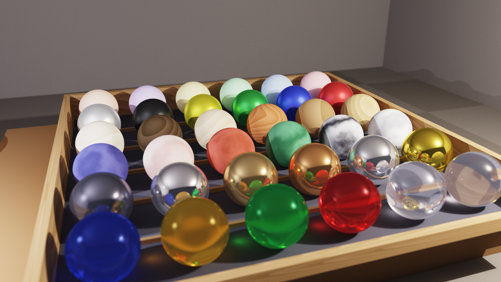

# 3D-Ray: High-Performance .NET 10 RayTracer Engine

   

Un moderno motore di ray tracing ad alte prestazioni sviluppato in C# e .NET 10, con configurazione di scene tramite YAML e capacità di rendering avanzate basate su fisica (PBR).

> **English Description:** *A modern, parallelized ray-tracing engine built with C# and .NET 10, featuring YAML scene configuration and advanced physically-based rendering capabilities.*



---

## 🔍 Panoramica (Overview)

**3D-Ray** è un motore di rendering ray-tracing ad alte prestazioni sviluppato in C# su piattaforma .NET 10. È progettato per ricercatori, sviluppatori e appassionati di computer grafica che necessitano di uno strumento flessibile e potente per generare immagini fotorealistiche partendo da descrizioni testuali delle scene.

Il motore risolve il problema della visualizzazione di geometrie complesse e materiali fisicamente basati (PBR) attraverso un'architettura modulare e ottimizzata per il calcolo parallelo multi-core, con un pipeline di post-processing ACES filmic per risultati visivi di qualità cinematografica.

> **Nota di Sviluppo:** Sebbene il progetto sia basato su .NET 10 (cross-platform), è stato testato e validato principalmente in ambiente **Windows**.

---

## ✨ Caratteristiche Principali (Key Features)

### Rendering
- 🚀 **Rendering Parallelo**: sfrutta tutti i core logici della CPU tramite `Parallel.For` per una scalabilità lineare delle prestazioni.
- 🔁 **Path Tracing** con rimbalzi multipli (configurable max depth): riflessi, rifrazioni, occlusion ambientale e color bleeding emergono naturalmente.
- 🎯 **Next Event Estimation (NEE)**: campionamento diretto delle sorgenti di luce per convergenza più veloce. Ogni bounce testa direttamente tutte le luci nella scena.
- 🧮 **Campionamento Stratificato**: jittered stratified sampling `√N × √N` per pixel — riduce il rumore senza aumentare i campioni totali.
- 🎞️ **Tone Mapping ACES Filmic**: pipeline di post-processing con curva filmica ACES e correzione gamma 2.2, per highlight naturali e colori ricchi.
- 🌅 **Gradient Sky**: cielo procedurale con gradiente verticale zenith→orizzonte→terreno e sun disk con glow halo configurabile.
- 🌍 **HDRI / IBL**: Image-Based Lighting con environment map HDR (formato Radiance `.hdr`). Illuminazione realistica da fotografie reali, con rotazione Y-axis e moltiplicatore di intensità.

### Accelerazione
- 📦 **BVH (Bounding Volume Hierarchy)**: struttura di accelerazione con euristica dell'asse più lungo (SAH-inspired) per intersezioni raggio-oggetto in tempo **O(log N)**. Attivata automaticamente per scene con più di 4 oggetti.

### Primitive Geometriche
- 🔵 **Sphere** — Sfera con UV mapping sferico
- 📦 **Box** — Cubo unitario con UV mapping planare per faccia
- 🔷 **Quad** — Parallelogramma con UV mapping baricentric
- 🔺 **Triangle** — Triangolo via algoritmo Möller–Trumbore
- 🔴 **Disk** — Disco piatto con UV mapping polare
- 🏛️ **Cylinder** — Cilindro finito con caps e UV cylindrical
- ∞ **Infinite Plane** — Piano infinito con UV mapping con tiling

### Materiali
- 🎨 **Lambertian** — Diffusione opaca fisicamente corretta
- 🪞 **Metal** — Riflessione speculare con parametro `fuzz` per rugosità superficiale
- 💎 **Dielectric** — Rifrazione con indice IOR variabile, effetto Fresnel (Schlick), supporto tinting colore
- 💡 **Emissive** — Materiale auto-luminoso con `color` e `intensity` configurabili

### Texture
- ♟️ **Checker** — Scacchiera 3D con scala configurabile
- 🌫️ **Noise** — Perlin Noise per superfici granulate o sporche
- 🗿 **Marble** — Venature marmoree con turbolenza matematica
- 🪵 **Wood** — Anelli di accrescimento concentrici
- 🖼️ **Image** — Texture da file immagine (PNG, JPEG, BMP, TIFF, WebP) con bilinear filtering, conversione sRGB→lineare e tiling UV configurabile. Supporta tutti i materiali e tutte le primitive.
- 🗺️ **Normal Map** — Perturbazione delle normali di shading tramite immagine RGB (tangent-space). Aggiunge dettaglio di superficie (fughe, graffi, rilievi) senza geometria aggiuntiva. Supportata da tutti e 4 i tipi di materiale, su tutte le primitive. Compatibile OpenGL (R=X, G=Y, B=Z) con opzione `flip_y` per mappe DirectX-style.

Tutte le texture procedurali supportano **offset**, **rotation** e **randomizzazione per-oggetto** tramite seed deterministico.

### Sistema di Trasformazione
- 🔄 **Transform wrapper** — Scale, Rotate e Translate applicabili a qualsiasi primitiva, con trasformazione corretta delle normali via matrice inversa trasposta (gestione corretta dello scaling non uniforme) e propagazione del frame TBN per il normal mapping.

### Sistema di Illuminazione
- 💡 **Point Light** — Luce puntiforme con attenuazione quadratica della distanza
- ☀️ **Directional Light** — Luce direzionale parallela (sole), senza attenuazione
- 🔦 **Spot Light** — Faretto con cono interno/esterno e falloff liscio
- 🟧 **Area Light** — Emettitore rettangolare con **soft shadows** fisicamente corretti via campionamento Monte Carlo (configurabile: 8–32 shadow samples, override globale via CLI `-S`)
- ✨ **Emissive Objects** — Qualsiasi geometria con materiale `emissive` diventa una sorgente di luce visibile. La luce emessa si propaga nella scena tramite i rimbalzi del path tracer, creando illuminazione indiretta naturale senza bisogno di luci esplicite.

### Ambiente
- 🌅 **Gradient Sky** — Cielo procedurale con gradiente verticale a 3 bande (zenith, orizzonte, terreno) e sun disk con glow halo. Il cielo agisce come sorgente di illuminazione globale: i raggi che escono dalla scena campionano il gradiente, producendo GI colorata naturale (azzurra dall'alto, calda dall'orizzonte). Configurabile via YAML con preset per mezzogiorno, golden hour, tramonto e notte.
- 🌍 **HDRI / IBL** — Image-Based Lighting con environment map HDR (formato Radiance `.hdr`). Illuminazione realistica catturata da fotografie reali: riflessi metallici credibili, rifrazioni naturali, GI accurata. Supporta rotazione Y-axis per allineare l'ambiente alla scena e moltiplicatore di intensità per il controllo dell'esposizione. File `.hdr` scaricabili gratuitamente da [Poly Haven](https://polyhaven.com/hdris).

### Input/Output
- 📄 **Configurazione YAML** — Definizione completa della scena tramite file YAML strutturati
- 🖼️ **Formati immagine** — PNG (lossless), JPEG, BMP — rilevamento automatico dall'estensione

---

## 🛠️ Stack Tecnologico

- **Linguaggio**: C# 13 / .NET 10
- **Librerie Core**:
  - `SixLabors.ImageSharp 3.1.12` — Manipolazione e salvataggio immagini in vari formati
  - `YamlDotNet 16.3.0` — Parsing dei file di configurazione delle scene
  - `System.Numerics` — Calcolo vettoriale ottimizzato (SIMD)

---

## 🚀 Installazione e Compilazione

### Prerequisiti
- **.NET 10 SDK** (o versione successiva) installato sul sistema.

### Compilazione
Clona il repository e compila il progetto:

```powershell
cd 3d-ray
dotnet build src/RayTracer/RayTracer.csproj -c Release
```

### Esecuzione

```powershell
cd 3d-ray
dotnet run --project src/RayTracer/RayTracer.csproj -c Release -- -i ./scenes/chess.yaml -s 256 -d 50 -o render.png -w 1920 -H 1080
```

---

## 📖 Guida all'Uso (Usage) e CLI

### Parametri CLI

| Parametro | Alias | Default | Descrizione |
|-----------|-------|---------|-------------|
| `--input` | `-i` | — (**obbligatorio**) | Percorso del file YAML descrittivo della scena. |
| `--output` | `-o` | `render.png` | Nome/percorso del file immagine di output. |
| `--width` | `-w` | `1200` | Larghezza dell'immagine in pixel. |
| `--height` | `-H` | `800` | Altezza dell'immagine in pixel. |
| `--samples` | `-s` | `16` | Campioni per pixel (anti-aliasing e riduzione del rumore). Il numero effettivo viene arrotondato al quadrato perfetto superiore (`√N × √N`). |
| `--depth` | `-d` | `50` | Massimo numero di rimbalzi ricorsivi per raggio (riflessi, rifrazioni). |
| `--shadow-samples` | `-S` | *(da YAML)* | Override globale dei shadow samples per tutte le area light. Se non specificato, ogni luce usa il proprio valore YAML (default: 16). |
| `--help` | `-h` | — | Mostra il messaggio di aiuto ed esce. |

> **Nota:** `-H` usa la lettera maiuscola perché `-h` è riservato a `--help`. Analogamente, `-S` (maiuscola) è per `--shadow-samples`, mentre `-s` (minuscola) è per `--samples`.

---

## 📚 Tutorials

Per approfondire l'utilizzo del motore e la creazione delle scene, consulta i seguenti tutorial:

- [**Guida all'Uso**](./tutorials/01-tutorial-utilizzo.md) — Dettagli completi sui parametri CLI, profili di rendering, ottimizzazione e risoluzione problemi.
- [**Creazione delle Scene**](./tutorials/02-tutorial-scene.md) — Guida completa alla sintassi YAML: geometrie, materiali, texture, luci, camera e trasformazioni.
- [**Libreria di Preset e Asset**](./tutorials/03-libreria-preset.md) — Catalogo di ambienti, configurazioni camera, sistemi di illuminazione e materiali pronti all'uso.

---

## 💡 Esempi Pratici

### Anteprima Rapida
Verifica il posizionamento della camera e degli oggetti in pochi secondi:
```powershell
dotnet run --project src/RayTracer/RayTracer.csproj -- -i scenes/chess.yaml -o preview.png -w 400 -H 267 -s 1 -d 5 -S 4
```

### Qualità Draft
Valuta materiali e texture senza attendere il render finale:
```powershell
dotnet run --project src/RayTracer/RayTracer.csproj -- -i scenes/chess.yaml -o draft.png -w 800 -H 533 -s 16 -d 20
```

### Produzione Full HD
Immagine finale pulita con anti-aliasing elevato:
```powershell
dotnet run --project src/RayTracer/RayTracer.csproj -- -i scenes/chess.yaml -o final.png -w 1920 -H 1080 -s 128 -d 50 -S 32
```

### Output in JPEG
Il formato viene rilevato automaticamente dall'estensione:
```powershell
dotnet run --project src/RayTracer/RayTracer.csproj -- -i scenes/chess.yaml -o render.jpg -s 32
```

---

## 🤖 Collaborazione AI

Questo progetto è stato sviluppato con il supporto di tecnologie di Intelligenza Artificiale agentica e modelli di linguaggio avanzati:


---

## 📄 Licenza

Questo progetto è distribuito sotto licenza **MIT**. Consulta il file [LICENSE](LICENSE) per i dettagli.

> [!NOTE]
> Il progetto utilizza `SixLabors.ImageSharp` (Six Labors Split License) e `YamlDotNet` (MIT), entrambi compatibili con l'uso open-source.
