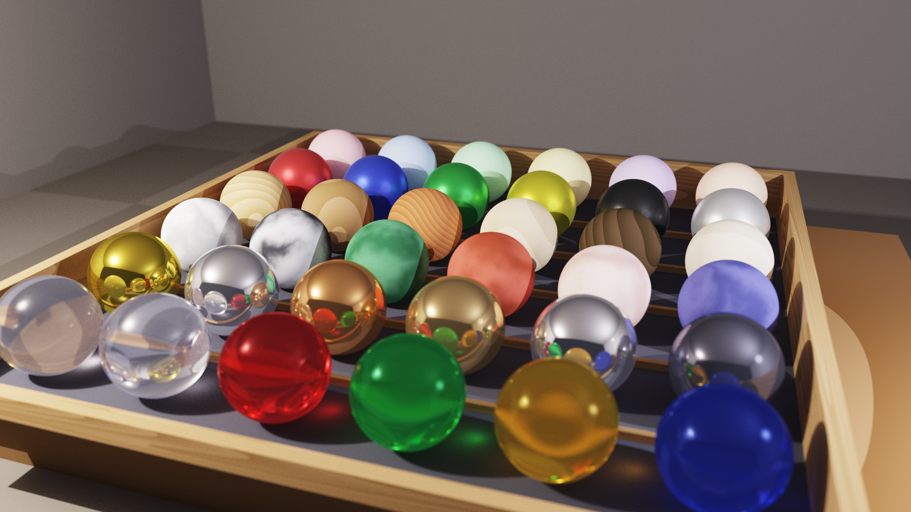

# 3D-Ray: High-Performance .NET 10 RayTracer Engine

   

Un moderno motore di ray tracing ad alte prestazioni sviluppato in C# e .NET 10, con configurazione di scene tramite YAML e capacità di rendering avanzate basate su fisica (PBR).

> **English Description:** *A modern, parallelized ray-tracing engine built with C# and .NET 10, featuring YAML scene configuration and advanced physically-based rendering capabilities.*



---

## 🔍 Panoramica (Overview)

**3D-Ray** è un motore di rendering ray-tracing ad alte prestazioni sviluppato in C# su piattaforma .NET 10. È progettato per sviluppatori e appassionati di computer grafica che necessitano di uno strumento flessibile e potente per generare immagini fotorealistiche partendo da descrizioni testuali delle scene.

Il motore risolve il problema della visualizzazione di geometrie complesse e materiali fisicamente basati (PBR) attraverso un'architettura modulare e ottimizzata per il calcolo parallelo multi-core, con un pipeline di post-processing ACES filmic per risultati visivi di qualità cinematografica.

---

## ✨ Caratteristiche Principali (Key Features)

### Rendering
- 🚀 **Rendering Parallelo**: sfrutta tutti i core logici della CPU tramite `Parallel.For` per una scalabilità lineare delle prestazioni.
- 🔁 **Path Tracing** con rimbalzi multipli (configurable max depth): riflessi, rifrazioni, occlusion ambientale e color bleeding emergono naturalmente.
- 🎯 **Next Event Estimation (NEE)**: campionamento diretto delle sorgenti di luce per convergenza più veloce. Ogni bounce testa direttamente tutte le luci nella scena.
- 🧮 **Campionamento Stratificato**: jittered stratified sampling `√N × √N` per pixel — riduce il rumore senza aumentare i campioni totali.
- 🎞️ **Tone Mapping ACES Filmic**: pipeline di post-processing con curva filmica ACES e correzione gamma 2.2, per highlight naturali e colori ricchi.

### Accelerazione
- 📦 **BVH (Bounding Volume Hierarchy)**: struttura di accelerazione con euristica dell'asse più lungo (SAH-inspired) per intersezioni raggio-oggetto in tempo **O(log N)**. Attivata automaticamente per scene con più di 4 oggetti.

### Geometrie
- ⚪ **Sphere** — Sfera con UV mapping sferico (longitudine/latitudine)
- 📦 **Box** — Cubo/parallelepipedo allineato agli assi con UV mapping planare per faccia
- 🔩 **Cylinder** — Cilindro finito con caps; UV mapping cilindrico (corpo) e planare (caps)
- 🔺 **Triangle** — Triangolo con UV mapping baricentrico (u, v)
- 📐 **SmoothTriangle** — Triangolo con normali ai vertici (Phong shading) e mapping UV dell'artista
- ▰ **Quad** — Quadrilatero (parallelogramma) con UV mapping parametrico/planare (u, v [0, 1])
- ⏺ **Disk** — Disco piatto con UV mapping planare (proiezione locale)
- ⭕ **Annulus** — Disco piatto con un foro circolare (rondella); ideale per dettagli meccanici e bersagli
- 🍦 **Cone** — Cono finito (o tronco di cono) con caps; UV mapping cilindrico (corpo) e planare (caps)
- 💊 **Capsule** — Cilindro con estremità emisferiche (pillola); UV mapping continuo senza giunzioni
- 🍩 **Torus** — Toro (ciambella) definito da raggio maggiore e minore. Intersezione analitica tramite risolutore di quartiche per precisione assoluta senza artefatti.
- 🏠 **Mesh (OBJ)** — Modelli 3D da file Wavefront OBJ. Supporta **Smooth Shading** (normali per-vertex), mapping UV dell'artista, e BVH interno per rendering efficiente di migliaia di triangoli.
- ▬ **Infinite Plane** — Piano infinito con UV mapping planare tiled
- 🔷 **CSG (Constructive Solid Geometry)** — Operazioni booleane su solidi: **Union** (A ∪ B), **Intersection** (A ∩ B) e **Subtraction** (A \ B). Gli alberi CSG sono annidabili ricorsivamente — un nodo CSG è esso stesso un `IHittable`, quindi espressioni come `(A ∪ B) \ C` si costruiscono naturalmente. Completamente compatibile con il sistema di trasformazioni (scale/rotate/translate), texture e normal mapping.

### Materiali
- 🎨 **Lambertian** — Materiale opaco diffuso
- 🪞 **Metal** — Riflesso speculare con rugosità (`fuzz`) controllabile
- 💎 **Dielectric** — Vetro/trasparente con rifrazione e riflesso Fresnel
- 💡 **Emissive** — Materiale auto-luminoso che emette luce propria nella scena. Gli oggetti emissivi con geometria campionabile (Sphere, Box, Cylinder, Cone, Torus, Capsule, Annulus, Mesh, SmoothTriangle, Quad, Triangle, Disk) partecipano automaticamente alla NEE come Geometry Lights, riducendo il rumore rispetto al path tracing puro.
- 🌟 **Disney Principled BSDF** — Materiale PBR unificato (alias: `"disney"`, `"disney_bsdf"`, `"pbr"`). Un singolo tipo può rappresentare plastica, metallo, vetro, vernice auto, tessuto, pelle e qualsiasi combinazione intermedia tramite i parametri `metallic`, `roughness`, `subsurface`, `specular`, `sheen`, `clearcoat`, `spec_trans` e `ior`.

### Texture
- ♟ **Checker** — Scacchiera 3D procedurale
- 🌀 **Noise** — Rumore Perlin (liscio o turbolento)
- 🏔 **Marble** — Marmo procedurale
- 🪵 **Wood** — Legno procedurale
- 🖼 **Image Texture** — Texture da file immagine (PNG, JPEG, BMP, GIF, TIFF, WebP) con UV mapping nativo per primitiva, bilinear filtering e tiling configurabile
- 🗺 **Normal Map** — Perturbazione della normale di shading per dettaglio geometrico senza triangoli aggiuntivi. Supportata da tutti e 4 i tipi di materiale, su tutte le primitive. Compatibile OpenGL (R=X, G=Y, B=Z) con opzione `flip_y` per mappe DirectX-style.

Tutte le texture procedurali supportano **offset**, **rotation** e **randomizzazione per-oggetto** tramite seed deterministico.

### Sistema di Trasformazione
- 🔄 **Transform wrapper** — Scale, Rotate e Translate applicabili a qualsiasi primitiva, con trasformazione corretta delle normali via matrice inversa trasposta (gestione corretta dello scaling non uniforme) e propagazione del frame TBN per il normal mapping.

### Sistema di Illuminazione
- 💡 **Point Light** — Luce puntiforme con attenuazione quadratica della distanza
- ☀️ **Directional Light** — Luce direzionale parallela (sole), senza attenuazione
- 🔦 **Spot Light** — Faretto con cono interno/esterno e falloff liscio
- 🟧 **Area Light** — Emettitore rettangolare con **soft shadows** fisicamente corretti via campionamento Monte Carlo (configurabile: 8–32 shadow samples, override globale via CLI `-S`)
- ✨ **Emissive Objects** — Qualsiasi geometria con materiale `emissive` diventa una sorgente di luce visibile. La luce emessa si propaga nella scena tramite i rimbalzi del path tracer, creando illuminazione indiretta naturale senza bisogno di luci esplicite.
- 🌐 **Environment Light** — Il gradient sky (con sun disk) e l'HDRI partecipano alla NEE come sorgenti direzionali campionabili, accelerando la convergenza per scene illuminate dall'ambiente.

### Ambiente
- 🌅 **Gradient Sky** — Cielo procedurale con gradiente verticale a 3 bande (zenith, orizzonte, terreno) e sun disk con glow halo. Il cielo agisce come sorgente di illuminazione globale: i raggi che escono dalla scena campionano il gradiente, producendo GI colorata naturale (azzurra dall'alto, calda dall'orizzonte). Configurabile via YAML con preset per mezzogiorno, golden hour, tramonto e notte.
- 🌍 **HDRI / IBL** — Image-Based Lighting con environment map HDR (formato Radiance `.hdr`). Illuminazione realistica catturata da fotografie reali: riflessi metallici credibili, rifrazioni naturali, GI accurata. Supporta rotazione Y-axis per allineare l'ambiente alla scena e moltiplicatore di intensità per il controllo dell'esposizione. File `.hdr` scaricabili gratuitamente da [Poly Haven](https://polyhaven.com/hdris).

### Camera
- 📷 **Camera con Depth of Field** — Simulazione dell'apertura della lente con piano di fuoco configurabile.
- 🎥 **Multi-Camera** — Supporto per liste di camere nominate nel YAML (`cameras:`), selezionabili da CLI con `--camera <nome|indice>`. Utile per generare render da più angolazioni senza modificare la scena.

### Input/Output
- 📄 **Configurazione YAML** — Definizione completa della scena tramite file YAML strutturati
- 🖼️ **Formati immagine** — PNG (lossless), JPEG, BMP — rilevamento automatico dall'estensione

---

## 🛠️ Stack Tecnologico

- **Linguaggio**: C# 14 / .NET 10
- **Librerie Core**:
  - `SixLabors.ImageSharp 3.1.12` — Manipolazione e salvataggio immagini in vari formati
  - `YamlDotNet 16.3.0` — Parsing dei file di configurazione delle scene
  - `System.Numerics` — Calcolo vettoriale ottimizzato (SIMD)

---

## 🚀 Installazione e Compilazione

### Prerequisiti
- [**.NET 10 SDK**](https://dotnet.microsoft.com/download/dotnet/10.0) installato sul sistema.

### Compilazione
Clona il repository e compila il progetto:

```powershell
cd 3d-ray
dotnet build src/RayTracer/RayTracer.csproj -c Release
```

### Esecuzione

Render con qualità di prova della scena del pendolo di Newton:

```powershell
cd 3d-ray
dotnet run --project src/RayTracer/RayTracer.csproj -c Release -- -i scenes/pendolo-newton.yaml -s 16 -d 20 -o output/render-draft.png -w 480 -H 270
```

Render con qualità finale della scena del pendolo di Newton:

```powershell
cd 3d-ray
dotnet run --project src/RayTracer/RayTracer.csproj -c Release -- -i scenes/pendolo-newton.yaml -s 256 -d 60 -o output/render-final.png -w 1920 -H 1080
```

---

## 📁 Struttura del Progetto

```
3d-ray/
├── docs/                    # Documentazione del progetto
├── src/
│   ├── RayTracer/           # Motore principale
│   │   ├── Acceleration/    # BVH
│   │   ├── Camera/          # Camera con DOF
│   │   ├── Core/            # Ray, HitRecord, MathUtils
│   │   ├── Geometry/        # Primitive (Sphere, Box, Cylinder, CsgObject...)
│   │   ├── Lights/          # Point, Directional, Spot, Area, GeometryLight, EnvironmentLight
│   │   ├── Materials/       # Lambertian, Metal, Dielectric, Emissive, Disney BSDF
│   │   ├── Rendering/       # Renderer, SkySettings, EnvironmentMap
│   │   ├── Scene/           # SceneLoader, SceneData
│   │   └── Textures/        # Checker, Noise, Marble, Wood, Image, NormalMap
│   └── Tools/
│       ├── TextureGen/      # Generatore texture procedurali (PNG)
│       └── NormalMapGen/    # Generatore flat normal map per test
├── scenes/                  # File YAML di esempio
├── output/                  # Immagini renderizzate
├── tutorials/               # Tutorial per l'uso del motore
└── .github/workflows/       # CI con smoke test
```

---

## 🛠️ Tool Inclusi

### TextureGen
Genera texture procedurali pronte all'uso (mattoni, legno, marmo, griglia UV):
```powershell
dotnet run --project src/Tools/TextureGen/TextureGen.csproj
```

### NormalMapGen
Genera una normal map piatta `(128, 128, 255)` per testare il sistema di normal mapping senza artefatti:
```powershell
dotnet run --project src/Tools/NormalMapGen/NormalMapGen.csproj
```

---

## 📖 Guida all'Uso (Usage) e CLI

### Parametri CLI

| Parametro | Alias | Default | Descrizione |
|-----------|-------|---------|-------------|
| `--input` | `-i` | — (**obbligatorio**) | Percorso del file YAML descrittivo della scena. |
| `--output` | `-o` | `output/render-<scena>.png` | Nome/percorso del file immagine di output. Se omesso, viene generato automaticamente dal nome della scena (es. `-i scenes/chess.yaml` → `output/render-chess.png`). |
| `--width` | `-w` | `1200` | Larghezza dell'immagine in pixel. |
| `--height` | `-H` | `800` | Altezza dell'immagine in pixel. |
| `--samples` | `-s` | `16` | Campioni per pixel (anti-aliasing e riduzione del rumore). Il numero effettivo viene arrotondato al quadrato perfetto superiore (`√N × √N`). |
| `--depth` | `-d` | `50` | Massimo numero di rimbalzi ricorsivi per raggio (riflessi, rifrazioni). |
| `--shadow-samples` | `-S` | *(da YAML)* | Override globale dei shadow samples per tutte le area light. Se non specificato, ogni luce usa il proprio valore YAML (default: 16). |
| `--camera` | `-c` | *(prima camera)* | Seleziona la camera da usare per nome o indice (0-based). Funziona solo con la sintassi `cameras:` (lista) nel YAML. |
| `--list-cameras` | — | — | Elenca tutte le camere definite nella scena ed esce senza renderizzare. |
| `--help` | `-h` | — | Mostra il messaggio di aiuto ed esce. |

> **Nota:** `-H` usa la lettera maiuscola perché `-h` è riservato a `--help`. Analogamente, `-S` (maiuscola) è per `--shadow-samples`, mentre `-s` (minuscola) è per `--samples`.

---

## 📚 Tutorials

Per approfondire l'utilizzo del motore e la creazione delle scene, consulta i seguenti tutorial:

- [**Guida all'Uso**](./tutorials/01-tutorial-utilizzo.md) — Dettagli completi sui parametri CLI, profili di rendering, ottimizzazione e risoluzione problemi.
- [**Creazione delle Scene**](./tutorials/02-tutorial-scene.md) — Guida completa alla sintassi YAML: geometrie, materiali, texture, luci, camera e trasformazioni.
- [**Libreria di Preset e Asset**](./tutorials/03-libreria-preset.md) — Catalogo di ambienti, configurazioni camera, sistemi di illuminazione e materiali pronti all'uso.
- [**Libreria CSG — Oggetti e Preset Booleani**](./tutorials/04-libreria-csg.md) — Catalogo di forme CSG pronte all'uso: lenti, anelli, colonne scavate, bulloni e alberi booleani complessi.

---

## 📖 Documentazione Tecnica (Deep Dives)

Per chi desidera approfondire gli aspetti matematici e le scelte implementative del motore:

- [**Modello di Shading e Materiali**](./docs/technical/shading-model.md) — Dettagli sul modello Disney BSDF, Fresnel (Schlick) e Normal Mapping (TBN).
- [**Path Tracing e Illuminazione**](./docs/technical/path-tracing-and-lighting.md) — Funzionamento del motore, Next Event Estimation (NEE) e Russian Roulette.
- [**Strutture di Accelerazione (BVH)**](./docs/technical/acceleration-structures.md) — Ottimizzazione delle intersezioni spaziali tramite Bounding Volume Hierarchy e SAH.
- [**Geometria del Toro e Risolutore di Quartiche**](./docs/technical/quartic-solver-and-torus.md) — Derivazione analitica dell'intersezione raggio-toro e metodo di Ferrari.

---

## 💡 Esempi Pratici

### Anteprima Rapida
Verifica il posizionamento della camera e degli oggetti in pochi secondi:
```powershell
dotnet run --project src/RayTracer/RayTracer.csproj -- -i scenes/chess.yaml -o preview.png -w 400 -H 267 -s 1 -d 5 -S 4
```

### Qualità Draft
Valuta materiali e texture senza attendere il render finale:
```powershell
dotnet run --project src/RayTracer/RayTracer.csproj -- -i scenes/chess.yaml -o draft.png -w 800 -H 533 -s 16 -d 20
```

### Produzione Full HD
Immagine finale pulita con anti-aliasing elevato:
```powershell
dotnet run --project src/RayTracer/RayTracer.csproj -- -i scenes/chess.yaml -o final.png -w 1920 -H 1080 -s 128 -d 50 -S 32
```

### Output in JPEG
Il formato viene rilevato automaticamente dall'estensione:
```powershell
dotnet run --project src/RayTracer/RayTracer.csproj -- -i scenes/chess.yaml -o render.jpg -s 32
```

### Multi-Camera
Elenca le camere disponibili e renderizza da una specifica:
```powershell
dotnet run --project src/RayTracer/RayTracer.csproj -- -i scenes/chess.yaml --list-cameras
dotnet run --project src/RayTracer/RayTracer.csproj -- -i scenes/chess.yaml -c top -o top.png
dotnet run --project src/RayTracer/RayTracer.csproj -- -i scenes/chess.yaml -c 2 -o cam2.png
```

---

## 🤖 Collaborazione AI

Questo progetto è stato sviluppato con il supporto di tecnologie di Intelligenza Artificiale agentica e modelli di linguaggio avanzati:


---

## 📄 Licenza

Questo progetto è distribuito sotto licenza **MIT**. Consulta il file [LICENSE](LICENSE) per i dettagli.
